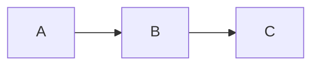

# SafeTrust Documentation

Welcome to the SafeTrust backend documentation repository.

SafeTrust is a decentralized P2P escrow platform for hospitality
bookings built on Stellar. This directory is the canonical source
of truth for architecture, data flows, and contributor guides.
Content is synced to the public Gitbook at docs.safetrust.xyz.

## Quick links

| Document | Description |
|---|---|
| [Multi-Tenant Architecture](architecture/multi-tenant.md) | Hasura tenant isolation |
| [Rust Crates](architecture/rust-crates.md) | Why Rust, what each crate does |
| [SafeTrust Schema Migration](migrations/safetrust-schema-migration.md) | Schema separation and Hasura metadata |

### Planned documentation

The following pages are part of the docs roadmap and will be added by
their dedicated issues. They are listed here for visibility but are not
linked until they land.

- **Architecture Overview** — full system diagram (planned)
- **Escrow Lifecycle** — full state machine (planned)
- **Fund Escrow** — fund flow diagram (planned)
- **Approve Milestone** — milestone flow diagram (planned)
- **Release Funds** — release flow diagram (planned)
- **Dispute & Resolve** — dispute flow diagram (planned)
- **x402 Protocol** — AI agent payment flow (planned)
- **ZK Privacy Layer** — zero-knowledge circuits (planned)
- **bin/start Guide** — local deployment (planned)
- **bin/deploy_init Guide** — benchmarking tool (planned)
- **Wave Guide** — contribution waves (planned)

## How to contribute to docs

1. Find the relevant file in `docs/`
2. Edit in place — Mermaid diagrams render on GitHub natively
3. Open a PR targeting `consolidation-pattern`
4. Gitbook syncs automatically after merge

## Mermaid diagrams

All diagrams use fenced Mermaid blocks. GitHub renders them
natively — no external tool needed. Example:

````text

````

## 📖 Table of Contents

- [Database](#-database)

---

## 🐘 Database

- [SafeTrust Schema Migration Strategy](migrations/safetrust-schema-migration.md) — Explains schema separation (`public` → `safetrust`), rationale, three-layer escrow hierarchy, deployment sequence, rollback strategy, and Hasura metadata changes.