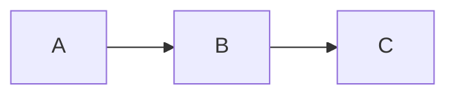

# SafeTrust Documentation

SafeTrust is a decentralized P2P escrow platform for hospitality
bookings built on Stellar. This directory is the canonical source
of truth for architecture, data flows, and contributor guides.
Content is synced to the public Gitbook at docs.safetrust.xyz.

## Quick links

| Document | Description |
|-----|-----|
| [Architecture Overview](architecture/overview.md) | Full system diagram |
| [Multi-Tenant Architecture](architecture/multi-tenant.md) | Hasura tenant isolation |
| [Rust Crates](architecture/rust-crates.md) | Why Rust, what each crate does |
| [Escrow Lifecycle](stellar/escrow-lifecycle.md) | Full state machine |
| [Fund Escrow](stellar/fund-escrow.md) | Fund flow diagram |
| [Approve Milestone](stellar/approve-milestone.md) | Milestone flow diagram |
| [Release Funds](stellar/release-funds.md) | Release flow diagram |
| [Dispute & Resolve](stellar/dispute-resolve.md) | Dispute flow diagram |
| [x402 Protocol](stellar/x402-protocol.md) | AI agent payment flow |
| [ZK Privacy Layer](zk/zk-overview.md) | Zero-knowledge circuits |
| [bin/start Guide](infra/bin-start.md) | Local deployment |
| [bin/deploy_init Guide](infra/deploy-init.md) | Benchmarking tool |
| [Wave Guide](contributing/wave-guide.md) | Contribution waves |

## How to contribute to docs

1. Find the relevant file in docs/
2. Edit in place — Mermaid diagrams render on GitHub natively
3. Open a PR targeting consolidation-pattern
4. Gitbook syncs automatically after merge

## Mermaid diagrams

All diagrams use fenced Mermaid blocks. GitHub renders them
natively — no external tool needed. Example:
