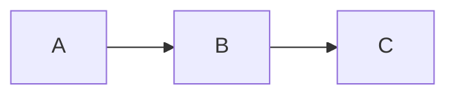

# 📚 backend-SafeTrust Documentation

Reference documentation for the SafeTrust backend — Hasura GraphQL, PostgreSQL,
the webhook service, and the multi-tenant deployment tooling.

For setup and day-to-day commands, start with the [root README](../README.md).

---

## Database

| Document | What it covers |
|---|---|
| [SafeTrust Schema Migration Strategy](migrations/safetrust-schema-migration.md) | Why SafeTrust tables moved from `public` to the `safetrust` schema, the deployment and rollback sequences, and the Hasura metadata YAML changes that go with them |

---

## Related reading in the root README

- [🏗️ Metadata Architecture](../README.md#️-metadata-architecture) — how
  `metadata/base` and `metadata/tenants/*` are merged and deployed
- [🛠️ Manual Commands](../README.md#️-manual-commands-optional) — per-tenant
  migration, metadata, and seed commands
- [Rollback migrations](../README.md#rollback-migrations) — rolling back a
  tenant's migrations with `hasura migrate apply --type down`

---

## Contributing to the docs

Documentation changes follow the same conventions as code changes — see
[CONTRIBUTORS_GUIDELINE.md](../CONTRIBUTORS_GUIDELINE.md) and
[GIT_GUIDELINE.md](../GIT_GUIDELINE.md). Use a `docs/` branch prefix and a
`docs:` commit type.

Diagrams are written as [Mermaid](https://mermaid.js.org) fenced code blocks so
they render on GitHub without a build step. Two house rules keep them portable
across GitHub, GitBook, and standalone Mermaid renderers:

- At most **2** `\n` line breaks per node label
- No subgraph nested more than **1** level deep
# 📚 SafeTrust Documentation
# SafeTrust Documentation

Welcome to the SafeTrust backend documentation repository.

SafeTrust is a decentralized P2P escrow platform for hospitality
bookings built on Stellar. This directory is the canonical source
of truth for architecture, data flows, and contributor guides.
Content is synced to the public Gitbook at docs.safetrust.xyz.

## Quick links

| Document | Description |
|---|---|
| [Multi-Tenant Architecture](architecture/multi-tenant.md) | Hasura tenant isolation |
| [Rust Crates](architecture/rust-crates.md) | Why Rust, what each crate does |
| [SafeTrust Schema Migration](migrations/safetrust-schema-migration.md) | Schema separation and Hasura metadata |

### Planned documentation

The following pages are part of the docs roadmap and will be added by
their dedicated issues. They are listed here for visibility but are not
linked until they land.

- **Architecture Overview** — full system diagram (planned)
- **Escrow Lifecycle** — full state machine (planned)
- **Fund Escrow** — fund flow diagram (planned)
- **Approve Milestone** — milestone flow diagram (planned)
- **Release Funds** — release flow diagram (planned)
- **Dispute & Resolve** — dispute flow diagram (planned)
- **x402 Protocol** — AI agent payment flow (planned)
- **ZK Privacy Layer** — zero-knowledge circuits (planned)
- **bin/start Guide** — local deployment (planned)
- **bin/deploy_init Guide** — benchmarking tool (planned)
- **Wave Guide** — contribution waves (planned)

## How to contribute to docs

1. Find the relevant file in `docs/`
2. Edit in place — Mermaid diagrams render on GitHub natively
3. Open a PR targeting `consolidation-pattern`
4. Gitbook syncs automatically after merge

## Mermaid diagrams

All diagrams use fenced Mermaid blocks. GitHub renders them
natively — no external tool needed. Example:

````text

````

## 📖 Table of Contents

- [Database](#-database)

---

## 🐘 Database

- [SafeTrust Schema Migration Strategy](migrations/safetrust-schema-migration.md) — Explains schema separation (`public` → `safetrust`), rationale, three-layer escrow hierarchy, deployment sequence, rollback strategy, and Hasura metadata changes.