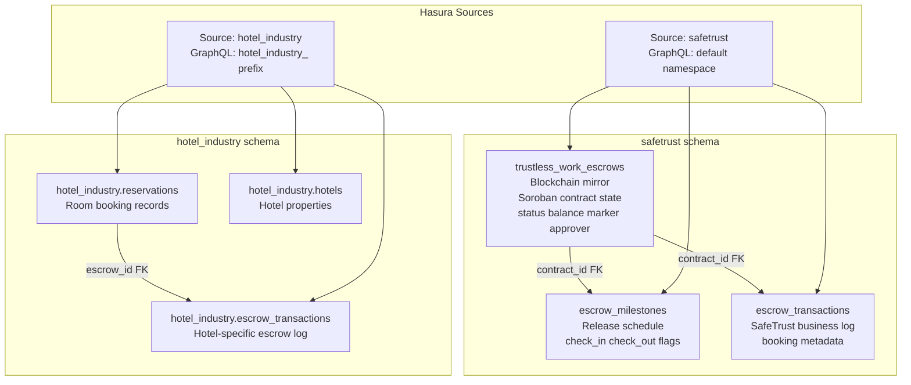
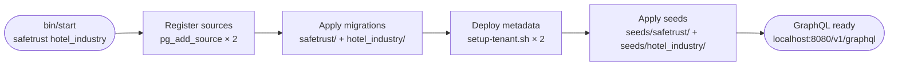

# Multi-Tenant Architecture

SafeTrust exposes a single Hasura GraphQL endpoint backed by one PostgreSQL
instance. The database is split into two named schemas, each mapped to its own
Hasura **source**. This document explains why the split exists, how it works,
and the conventions contributors must follow.

---

## Table of Contents

- [Why two schemas?](#why-two-schemas)
- [Schema overview](#schema-overview)
- [Three-layer escrow hierarchy](#three-layer-escrow-hierarchy)
- [Deployment flow](#deployment-flow)
- [YAML metadata file naming](#yaml-metadata-file-naming)
- [Admin secret security](#admin-secret-security)
- [Running one tenant vs both](#running-one-tenant-vs-both)

---

## Why two schemas?

SafeTrust has two product lines sharing one database:

| Tenant | Schema | Domain |
|---|---|---|
| `safetrust` | `safetrust` | Apartment rentals with P2P escrow |
| `hotel_industry` | `hotel_industry` | Hotel room reservations with escrow |

Using separate PostgreSQL schemas gives each tenant hard namespace isolation:
a `SELECT * FROM reservations` executed in the `safetrust` search path never
touches `hotel_industry.reservations`. Row-level security policies in Hasura
reinforce this via the `X-Hasura-Tenant-Id` claim on every JWT.

Both sources point to the same `PG_DATABASE_URL`. There is no second database
to operate or back up.

---

## Schema overview

```
PostgreSQL (single instance)
├── safetrust schema
│   ├── users, user_wallets, roles, user_roles
│   ├── apartments, apartment_images
│   ├── reservations, bid_requests, bid_status_histories
│   ├── pricing_rules, pricing_overrides
│   ├── conversations, messages
│   ├── trustless_work_escrows          ← blockchain mirror
│   ├── escrow_milestones               ← release schedule
│   ├── escrow_transactions             ← business log
│   ├── escrow_pending_approvals
│   └── trustless_work_webhook_events
└── hotel_industry schema
    ├── users, users_wallets
    ├── hotels, room_types, rooms, room_images
    ├── reservations
    ├── pricing_rules
    ├── conversations, messages
    ├── escrow_transactions             ← hotel-specific escrow log
    └── escrow_transaction_users
```

---

## Three-layer escrow hierarchy

### safetrust tenant

The `safetrust` escrow model has three tiers:

1. **`trustless_work_escrows`** — A mirror of the Soroban smart-contract state
   on the Stellar blockchain. Each row corresponds to one on-chain escrow and
   records the contract address, the wallet roles (`marker`, `approver`,
   `releaser`, `resolver`), current `status`, and `balance`. This table is the
   source of truth for what the blockchain says.

2. **`escrow_milestones`** — The release schedule for `multi_release` escrows.
   Each milestone (`check_in`, `check_out`, …) has its own `amount`,
   `due_date`, and approval/release timestamps. Milestones reference
   `trustless_work_escrows` via `escrow_id`.

3. **`escrow_transactions`** — SafeTrust's business-level log. Records the HTTP
   interactions with the TrustlessWork API (request type, status code, payload),
   links back to a `bid_request`, and tracks cancellation and refund state.



### hotel_industry tenant

The hotel model is flatter:

- `hotels` → `rooms` → `reservations` → `escrow_transactions`

`hotel_industry.escrow_transactions.reservation_id` is a foreign key to
`hotel_industry.reservations.id`. There is no milestone layer; the hotel tenant
uses single-release escrows for deposit settlement.

---

## Deployment flow

`bin/start` orchestrates the full stack bring-up in a fixed sequence:



**Step-by-step:**

| Step | What happens |
|---|---|
| Start containers | `docker compose up -d --build` starts `postgres`, `graphql-engine`, and `webhook` |
| Health check | Polls `GET /healthz` up to 3 minutes before continuing |
| Register sources | `pg_add_source` is called twice — once per tenant — both pointing at `PG_DATABASE_URL` |
| Apply migrations | `hasura migrate apply --database-name <tenant>` runs versioned SQL for each schema |
| Deploy metadata | `metadata/setup-tenant.sh <tenant>` merges tenant YAML with base config and applies it to Hasura |
| Apply seeds | Seed SQL files run inside PostgreSQL transactions; both tenants run concurrently |

Each seed file is wrapped in `BEGIN`/`COMMIT`. A failed file rolls back
completely. Re-running `bin/start` without `--reset` is safe because seed
inserts use conflict-safe patterns.

---

## YAML metadata file naming

Contributors frequently ask why the safetrust metadata files are named
`public_*.yaml` when the tables now live in the `safetrust` schema.

**Short answer:** the filenames are frozen snapshots from before the schema
migration. Renaming them would break the `!include` references in
`tables.yaml` without providing any functional benefit.

**Long answer:**

1. All safetrust tables were originally created in the `public` schema.
   Hasura's CLI generates YAML filenames using the pattern
   `<schema>_<table>.yaml` — so they were named `public_users.yaml`,
   `public_apartments.yaml`, etc.

2. Migration `1779300000001_migrate_to_safetrust_schema` used
   `ALTER TABLE … SET SCHEMA safetrust` to move every table atomically.
   The actual schema declaration inside each YAML file was updated:

   ```yaml
   # public_users.yaml (filename unchanged)
   table:
     name: users
     schema: safetrust   # ← now points to the correct schema
   ```

3. `tables.yaml` references files by their filesystem name:

   ```yaml
   - "!include public_users.yaml"
   ```

   Renaming the files would require updating every `!include` line.
   The `public_` prefix in the filename is therefore purely historical and
   carries no semantic meaning today.

The `hotel_industry` tenant was designed after the schema migration, so its
files use the correct `hotel_industry_*.yaml` naming convention from the start.

---

## Admin secret security

Hasura event triggers call the webhook service over HTTP. To authenticate those
calls, each event trigger injects the Hasura admin secret as a request header:

```yaml
# example from public_escrow_transactions.yaml
event_triggers:
  - name: on_escrow_created
    webhook: "{{WEBHOOK_URL}}/events/escrow-created"
    headers:
      - name: x-hasura-admin-secret
        value_from_env: HASURA_GRAPHQL_ADMIN_SECRET
```

The admin secret grants **unrestricted access to every GraphQL operation and
Hasura metadata API**, bypassing all row-level security and permission rules.
Anyone who holds it can read, write, or delete any row in any tenant.

**Why it must never appear in frontend environment variables:**

- Next.js (and any browser-executed JS framework) exposes any env var prefixed
  with `NEXT_PUBLIC_` to the client. If `NEXT_PUBLIC_HASURA_ADMIN_SECRET` were
  set, the secret would be embedded in the compiled JavaScript bundle and
  visible to every visitor via browser DevTools.
- A leaked admin secret gives an attacker full database access with no rate
  limiting, no audit trail enforced by row-level security, and no JWT
  validation.

The frontend must only hold the **JWT secret** (for signing user tokens). The
admin secret lives exclusively in:

- `.env` on developer machines (never committed — see `.gitignore`)
- Docker Compose environment variables (server-side only)
- CI/CD secrets (never printed in logs)

---

## Running one tenant vs both

```bash
# Start only the safetrust tenant
bin/start safetrust

# Start both tenants (typical for full local development)
bin/start safetrust hotel_industry
```

When a single tenant name is passed, only that tenant's migrations, metadata,
and seeds are applied. The other schema is not touched. This is useful for:

- Faster iteration on safetrust-only features.
- CI pipelines that test one tenant at a time.
- Debugging a migration without risk of affecting the other tenant's seed data.

`--reset` wipes Docker volumes entirely (both tenants are rebuilt from
scratch):

```bash
bin/start --reset safetrust hotel_industry
```

`--restart` recreates containers while keeping the database volumes intact:

```bash
bin/start --restart safetrust
```
