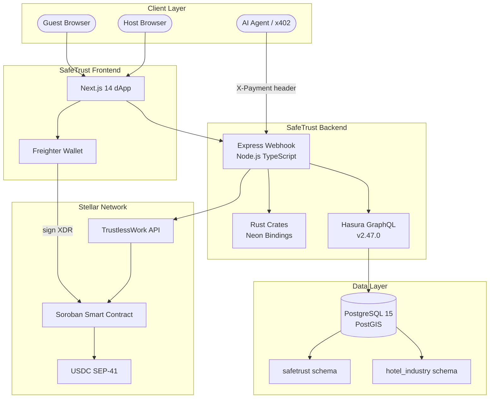
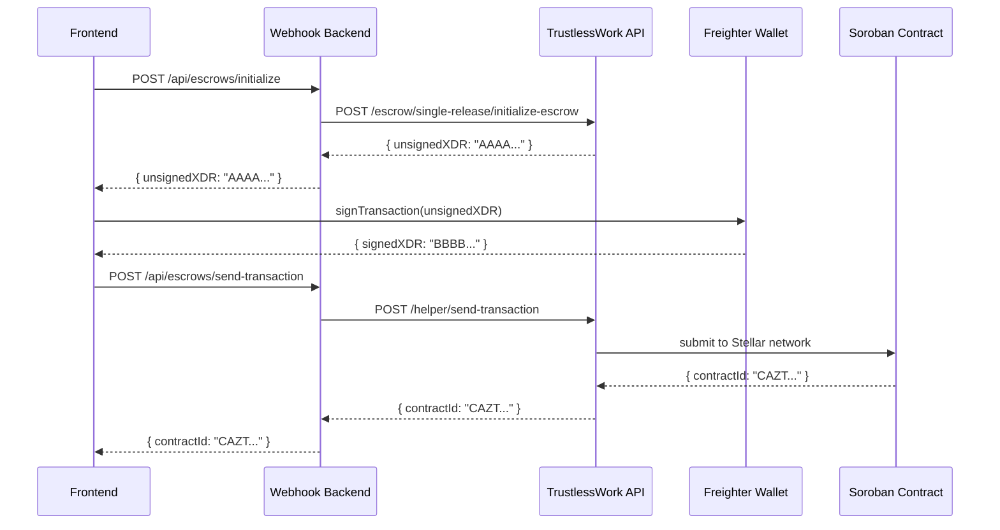
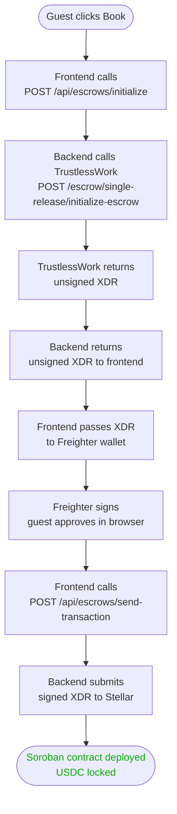
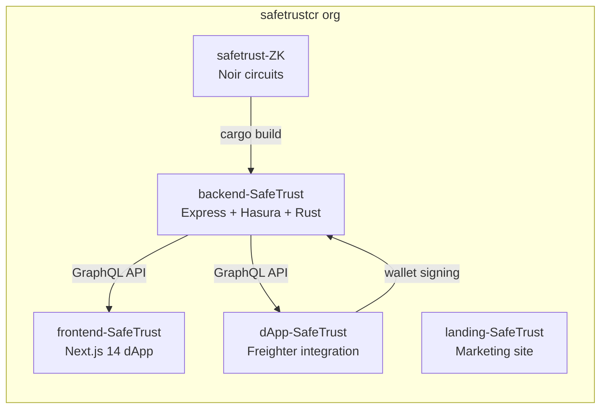

# SafeTrust Architecture Overview

SafeTrust connects four layers: a Next.js frontend, an Express
webhook backend, a Hasura GraphQL engine, and the Stellar
blockchain via TrustlessWork. Rust crates handle security-critical
and performance-critical work via Neon bindings.

## System diagram

## Two-phase XDR signing

Every escrow operation on Stellar requires two steps:

1. **Backend returns unsigned XDR** — SafeTrust calls TrustlessWork
   which builds the Soroban transaction but does not sign it
2. **Frontend signs with Freighter** — the guest or host wallet
   signs the XDR locally, then submits via `/helper/send-transaction`

This means SafeTrust never holds private keys.
The platform is non-custodial by design.

## Request flow for a booking

## Repository structure

