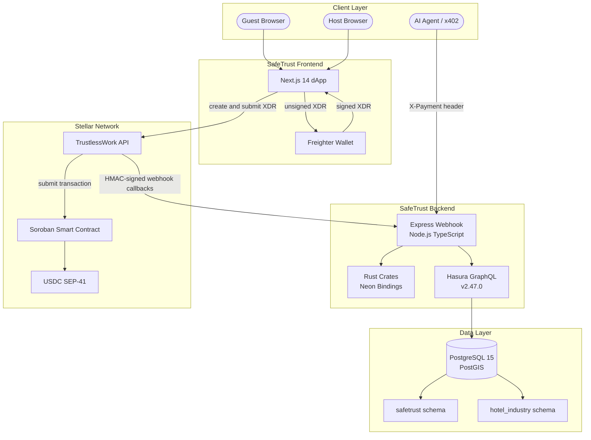
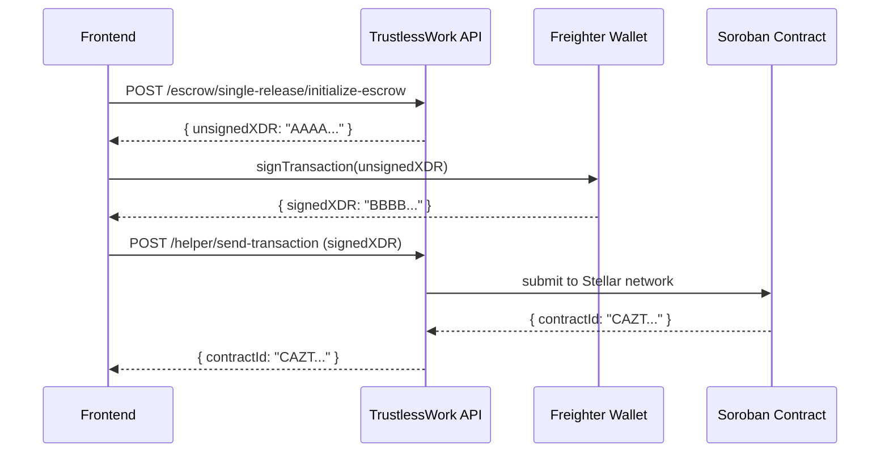
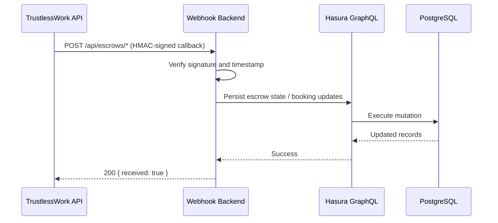
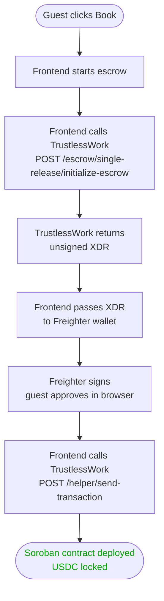
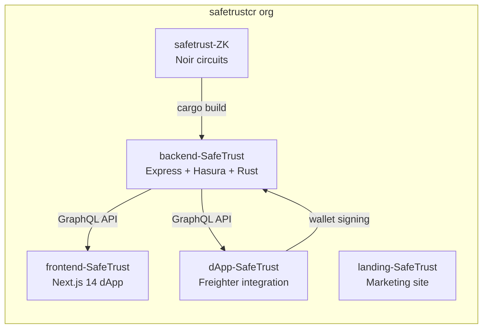

# SafeTrust Architecture Overview

SafeTrust connects four layers: a Next.js frontend, an Express
webhook backend, a Hasura GraphQL engine, and the Stellar
blockchain via TrustlessWork. Rust crates handle security-critical
and performance-critical work via Neon bindings.

## System diagram

## Frontend-managed XDR submission

Every escrow operation on Stellar requires two steps:

1. **Frontend receives an unsigned XDR** — the frontend calls TrustlessWork,
   which builds the Soroban transaction but does not sign it
2. **Frontend signs with Freighter** — the guest or host wallet
   signs the XDR locally, then the frontend submits it directly to
   TrustlessWork via `/helper/send-transaction`

SafeTrust's backend does not create, sign, or submit XDR, and it does not
expose `/api/escrows/send-transaction`. It receives the resulting escrow state
through separate HMAC-signed TrustlessWork webhook callbacks. This means
SafeTrust never holds private keys; the platform is non-custodial by design.

## Request flow for a booking

After TrustlessWork processes the transaction, it sends an HMAC-signed callback
to the webhook backend. The backend verifies the callback and mirrors the
escrow and booking state through Hasura; it never receives or submits XDR.

## Repository structure

