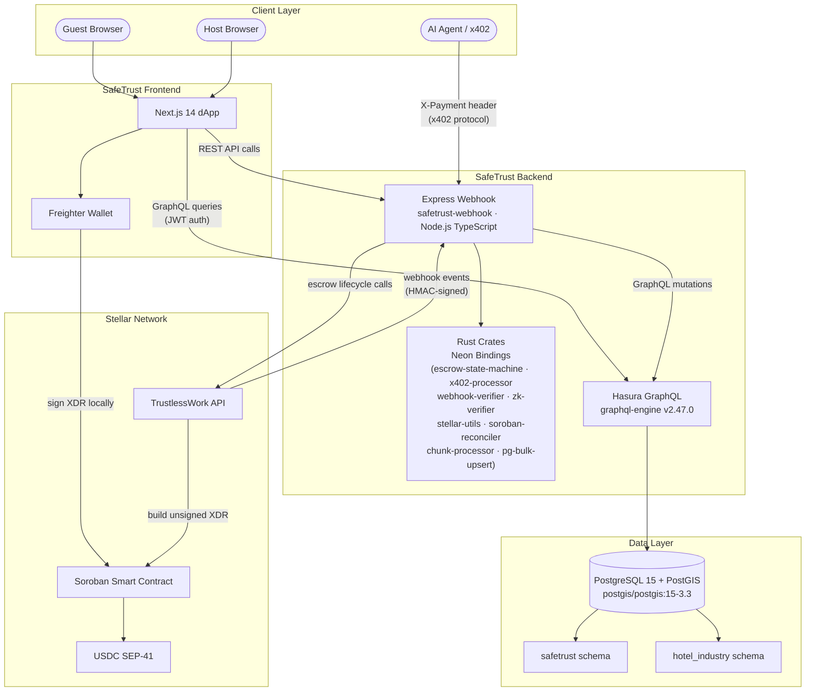

# SafeTrust Architecture Overview

SafeTrust connects four layers: a Next.js frontend, an Express webhook backend,
a Hasura GraphQL engine, and the Stellar blockchain via TrustlessWork. Rust
crates (compiled as Neon native addons) handle security-critical and
performance-critical work — HMAC verification, ZK proof validation, x402
payment processing, state machine enforcement, and bulk data reconciliation.

## System Diagram



## Layer Descriptions

### Client Layer

| Actor | Role |
|---|---|
| Guest / Host Browser | Human users interacting with the Next.js dApp |
| AI Agent / x402 | Autonomous agents that pay for API access using the x402 payment protocol (USDC on Stellar) |

### SafeTrust Backend

The webhook service (`safetrust-webhook`) is the central orchestrator. It is an
Express / TypeScript application that:

- Authenticates users via **Firebase Auth** JWT (`/api/auth`, `/api/apartments`,
  `/api/bid-requests`, `/api/reservations`)
- Validates **TrustlessWork HMAC-SHA256** webhook signatures on all
  `/api/escrows/*` callbacks
- Enforces the **x402 payment protocol** on `/api/escrows/initialize` when
  called by AI agents
- Calls TrustlessWork to drive the full escrow lifecycle
- Writes state to PostgreSQL through Hasura GraphQL mutations
- Runs a background reconciliation job at `/reconciliation`

**Rust crates (Neon native addons)** — compiled into `index.node` files and
`require()`-d directly from TypeScript:

| Crate | Purpose |
|---|---|
| `escrow-state-machine` | Compile-time escrow state transition table; enforces valid status progressions |
| `x402-processor` | Validates x402 payment headers and verifies USDC payments on Stellar |
| `webhook-verifier` | HMAC-SHA256 + Ed25519 verification for TrustlessWork webhook payloads |
| `zk-verifier` | Verifies Noir UltraHonk ZK proofs (proof-of-funds for private balances) |
| `stellar-utils` | Ed25519 key utilities and Stellar strkey helpers |
| `soroban-reconciler` | Reconciles on-chain Soroban escrow state against the local database |
| `chunk-processor` | Concurrently fetches escrow chunks from the TrustlessWork indexer (Tokio + reqwest) |
| `pg-bulk-upsert` | Bulk-upserts reconciled escrow rows into PostgreSQL via a single `UNNEST` statement |

### Data Layer

PostgreSQL 15 with PostGIS runs as the `postgres` service. Two tenant schemas
are managed independently by Hasura:

- **`safetrust`** — apartments, users, wallets, escrows, bids, reservations,
  conversations, pricing rules, webhook event log
- **`hotel_industry`** — hotels, rooms, reservations, escrow transactions,
  pricing rules, conversations

All schema changes go through versioned Hasura migration files in `migrations/`.

---

## Two-Phase XDR Signing

Every escrow operation on Stellar requires two steps. SafeTrust never holds
private keys — the platform is **non-custodial by design**.

**Phase 1 — Backend returns unsigned XDR**

SafeTrust calls TrustlessWork, which builds the Soroban transaction and returns
an unsigned XDR envelope. The backend forwards this to the frontend without
signing it.

**Phase 2 — Frontend signs with Freighter**

The guest or host wallet signs the XDR locally in the browser via the Freighter
extension. The signed XDR is then submitted to the Stellar network through
`/helper/send-transaction` on the TrustlessWork API.

```
Frontend  ──POST /api/escrows/<action>──►  safetrust-webhook
                                                │
                                         calls TrustlessWork
                                                │
                                    TrustlessWork builds XDR
                                                │
                                    returns unsigned XDR
                                                │
safetrust-webhook ◄────────────────────────────┘
        │
        └──► Frontend receives unsigned XDR
                    │
              Freighter prompts user
                    │
              User approves (signs)
                    │
        Frontend calls send-transaction
                    │
             Stellar network ◄─── signed XDR submitted
```

This design means:
- SafeTrust never stores or transmits private keys
- Every on-chain action requires explicit user approval in the browser
- The backend orchestrates but cannot unilaterally move funds

---

## Request Flow: Guest Books an Apartment

```
1.  Guest clicks "Book" in the Next.js dApp
      │
2.  Frontend  POST /api/escrows/initialize  ──►  safetrust-webhook
      │                                               │
      │                                  (webhook-verifier or x402-processor
      │                                   validates the request signature)
      │                                               │
      │                                  escrow-state-machine checks
      │                                  transition: ∅ → created
      │                                               │
      │                                  safetrust-webhook calls TrustlessWork
      │                                               │
3.                                       TrustlessWork returns unsigned XDR
      │                                               │
4.  safetrust-webhook  ──► persists escrow record via Hasura GraphQL mutation
      │                    (PostgreSQL: safetrust.trustless_work_escrows)
      │
5.  safetrust-webhook returns unsigned XDR to frontend
      │
6.  Frontend passes XDR to Freighter wallet
      │
7.  Freighter prompts guest to approve (browser pop-up)
      │
8.  Guest approves — Freighter signs the XDR locally
      │
9.  Frontend calls TrustlessWork /helper/send-transaction with signed XDR
      │
10. Soroban contract deployed — USDC locked in escrow on Stellar
      │
11. TrustlessWork emits  escrow.initialized  webhook event
      │
12. TrustlessWork  POST /api/escrows/initialize  ──►  safetrust-webhook
      │                                               │
      │                                  webhook-verifier validates HMAC-SHA256
      │                                               │
      │                                  event deduplicated via webhook event log
      │                                               │
      │                                  reservation linked to escrow in DB
```

### Subsequent escrow lifecycle events

Each subsequent action follows the same two-phase pattern:

| Frontend calls | Escrow action |
|---|---|
| `POST /api/escrows/fund` | Guest funds the escrow |
| `POST /api/escrows/approve-milestone` | Host / approver signs off a milestone |
| `POST /api/escrows/release-funds` | Funds released to host after milestone approval |
| `POST /api/escrows/dispute` | Guest or host opens a dispute |
| `POST /api/escrows/resolve-dispute` | Resolver settles the dispute |

TrustlessWork sends a corresponding HMAC-signed webhook event back to
`safetrust-webhook` after each on-chain state change, keeping the PostgreSQL
state in sync with the Soroban contract.

---

## Local Development

See the [Quick Start](../../README.md#-quick-start) section in the root README
for how to spin up all three services (`postgres`, `graphql-engine`,
`safetrust-webhook`) with a single `bin/start` command.

```
postgres                     :5433 (host) / 5432 (internal)
graphql-engine (Hasura)      :8080
safetrust-webhook            :3000
```
