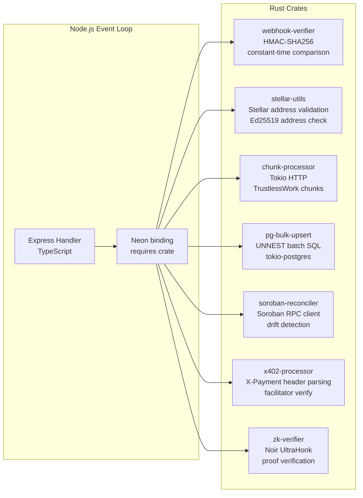

# Rust crates in SafeTrust

SafeTrust uses a small set of Rust crates behind Neon bindings so that Node.js can call into high-assurance native code for the parts of the platform that need cryptographic correctness, parallel CPU work, and blockchain-precise parsing.

## Why Rust is used

1. Security-critical cryptography
   JavaScript crypto is correct but has no compile-time guarantees. An empty HMAC secret, type coercion bug, or timing oracle all fail silently at runtime in JS. Rust catches these at compile time.

2. CPU-bound parallel processing
   Node.js runs on a single event loop thread. Concurrent HTTP chunk processing blocks the loop. Tokio (Rust async runtime) runs genuine OS threads without blocking Node.

3. Blockchain-native data handling
   XDR parsing, Stellar strkey validation, and Soroban RPC queries require binary precision. The stellar-xdr crate is used by Stellar Core itself — canonical implementation.

## Wiring diagram

## Crate responsibilities

The Rust layer is organized around seven crates under the `crates/` tree. Each crate is exposed to the Node.js runtime through a Neon binding and is used only where the native implementation is materially safer or faster than a plain JavaScript version.

| Crate                | Purpose                       | Key dependency                    | Env gate                     |
| -------------------- | ----------------------------- | --------------------------------- | ---------------------------- |
| `webhook-verifier`   | HMAC-SHA256 webhook signature | `hmac`, `constant_time_eq`        | always on                    |
| `stellar-utils`      | Stellar address validation    | `stellar-strkey`, `ed25519-dalek` | always on                    |
| `chunk-processor`    | Parallel TrustlessWork HTTP   | `tokio`, `reqwest`, `futures`     | `RUST_CHUNKS_ENABLED`        |
| `pg-bulk-upsert`     | UNNEST batch upsert           | `tokio-postgres`                  | `RUST_BULK_UPSERT_ENABLED`   |
| `soroban-reconciler` | Soroban RPC drift detection   | `reqwest`, `stellar-xdr`          | `SOROBAN_VALIDATION_ENABLED` |
| `x402-processor`     | x402 payment header parsing   | `reqwest`, `base64`               | `X402_ENABLED`               |
| `zk-verifier`        | Noir UltraHonk proof verify   | `acvm`                            | `ZK_ENABLED`                 |

## How they fit the platform

- `webhook-verifier` protects webhook integrity by verifying HMAC signatures in constant time before the request is trusted.
- `stellar-utils` guards addresses and keys before they are used in any decode or contract call path.
- `chunk-processor` splits large TrustlessWork fetches into independent async tasks so Node does not stall while HTTP data is processed.
- `pg-bulk-upsert` moves the costly, repetitive insert/update path into a bulk SQL operation that is much more efficient than row-by-row JavaScript writes.
- `soroban-reconciler` compares on-chain state and local state with Soroban RPC data, identifying drift or missed reconciliation events.
- `x402-processor` handles x402 payment metadata and verifies the payment headers without forcing Node to parse binary or encoded protocol payloads in JS.
- `zk-verifier` validates Noir proofs using a native proving runtime so the proof check remains deterministic and safe for trust-sensitive flows.

## Summary

Rust is not being added to the project for novelty. It is being used in exactly the places where JavaScript is weakest: signing validation, high-throughput async work, and blockchain-native binary parsing. The result is a safer backend with better runtime guarantees and more predictable performance under load.
