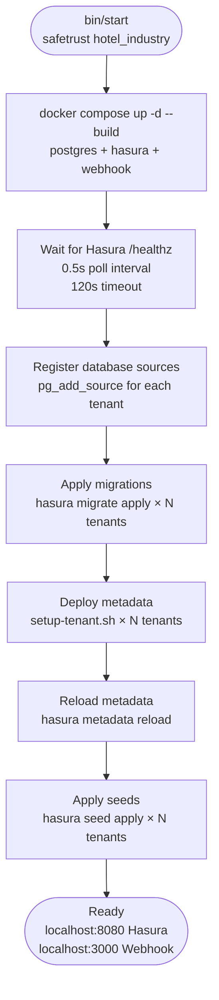

# bin/start

## Flow

## Prerequisites
- Docker
- hasura CLI
- yq

## Usage

- `bin/start safetrust` vs `bin/start safetrust hotel_industry`
- `bin/start --reset` — full teardown and fresh start
- `bin/start --restart` — restart containers, skip data
- `TRACK_SAFETRUST_TIMINGS=true` output format

## Common failures and fixes
- Port 5433 already in use
- Hasura health timeout
- Seed duplicate key errors
