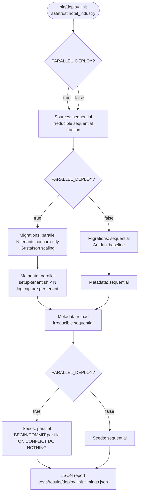

# bin/deploy_init

## Flow

## Gustafson's Law applied to SafeTrust

`S(N) = s + p×N`
where:
- `s` = sequential fraction (sources + metadata reload)
- `p` = parallel fraction (migrations + metadata + seeds)
- `N` = number of tenants

Example measurements:
- N=1 (sequential baseline): ~45s
- N=2 (parallel): ~28s → 142% efficiency
- N=5 (parallel): ~18s → 280% efficiency

## USE_INIT_SQL=true fast path
- `hasura migrate apply`: ~8s (15+ subprocess calls)
- `psql init.sql`: ~1s (1 transaction)
- Saving: ~7s per tenant

## When to use each tool

| Situation | Use |
| --- | --- |
| First time setup | `bin/start safetrust hotel_industry` |
| Code changed, keep DB | `bin/start --restart safetrust hotel_industry` |
| Full reset | `bin/start --reset safetrust hotel_industry` |
| Benchmark N tenants | `bin/deploy_init safetrust hotel_industry` |
| Measure parallel vs sequential | `PARALLEL_DEPLOY=false bin/deploy_init ...` |
| Test init.sql fast path | `USE_INIT_SQL=true bin/deploy_init ...` |
