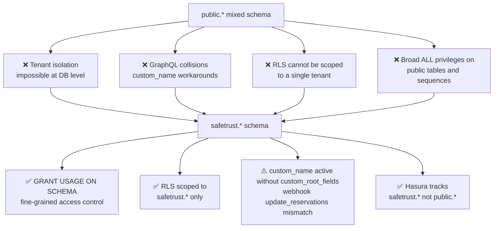
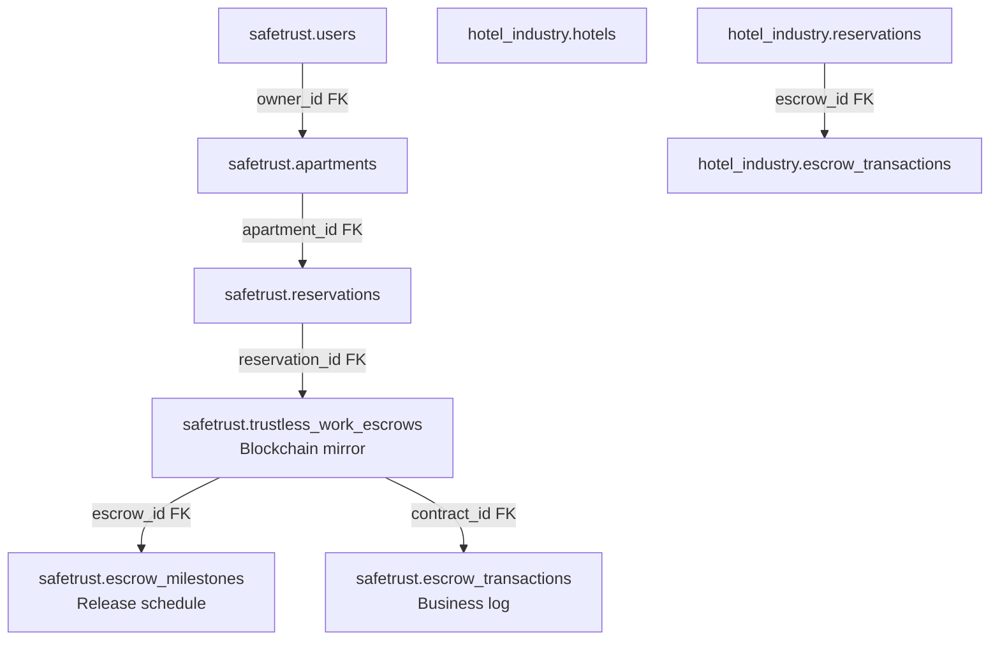
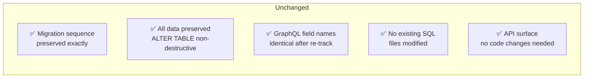

# SafeTrust Schema Migration Strategy

## Why this migration exists

All SafeTrust tables were originally created in the PostgreSQL `public` schema. Migration `1779300000001` moves them to the `safetrust` schema to enforce tenant data isolation at the PostgreSQL permission level.

### Before and after

```mermaid
flowchart LR
    subgraph BEFORE
        PUB[public schema]
        PUB --> A1[public.users]
        PUB --> A2[public.apartments]
        PUB --> A3[public.trustless_work_escrows]
        PUB --> A4[public.escrow_milestones]
        PUB --> A5[public.reservations]
        PUB --> A6[public.roles]
        PUB --> A7[...17 more tables]
    end

    subgraph AFTER
        ST[safetrust schema]
        HI[hotel_industry schema]
        ST --> B1[safetrust.users]
        ST --> B2[safetrust.apartments]
        ST --> B3[safetrust.trustless_work_escrows]
        ST --> B4[safetrust.escrow_milestones]
        ST --> B5[safetrust.reservations]
        HI --> C1[hotel_industry.hotels]
        HI --> C2[hotel_industry.rooms]
        HI --> C3[hotel_industry.reservations]
    end

    BEFORE -->|ALTER TABLE<br/>SET SCHEMA| AFTER
```



## Four reasons for schema separation



> [!NOTE]
> **Schema Privileges & Grants (Node P4)**: `GRANT USAGE ON SCHEMA safetrust` grants schema usage, not table or sequence access. The migration grants schema `USAGE` separately from `ALL` privileges on tables and sequences. The migration script must execute explicit `GRANT` commands for tables (`GRANT ALL ON ALL TABLES IN SCHEMA safetrust TO ...`) and sequences (`GRANT ALL ON ALL SEQUENCES IN SCHEMA safetrust TO ...`), alongside revoking default public schema privileges (`REVOKE ALL ON ALL TABLES IN SCHEMA public FROM ...`).

> [!NOTE]
> **Root Field Mapping Limitation (Node R3)**: The metadata sets `custom_name: safetrust_reservations` and `custom_name: hotel_reservations` without `custom_root_fields`. Hasura generates root operations derived from those custom names (e.g. `update_safetrust_reservations`) while webhook handlers still call `update_reservations`. A `custom_root_fields` mapping fix is required to map root operations back to expected field names.

## Three-layer escrow hierarchy after migration



## Deployment sequence


### Commands

```bash
# Step 1 — Apply database migration
hasura migrate apply \
  --endpoint http://localhost:8080 \
  --admin-secret myadminsecretkey \
  --database-name safetrust \
  --version 1779300000001 \
  --type up

# Step 2 — Reload Hasura metadata
hasura metadata apply \
  --endpoint http://localhost:8080 \
  --admin-secret myadminsecretkey

# Step 3 — GraphQL smoke test
curl -X POST http://localhost:8080/v1/graphql \
  -H "x-hasura-admin-secret: myadminsecretkey" \
  -H "Content-Type: application/json" \
  -d '{"query": "query { safetrust_reservations(limit: 1) { id } }"}'
```

## Rollback strategy

> [!WARNING]
> Running `hasura metadata apply` during rollback targets the current `metadata/` directory, which already contains `safetrust.*` tables and will not restore `public.*` tracking. A pre-migration metadata snapshot must exist prior to applying migration `1779300000001` in order to restore `public.*` schema tracking.


### Pre-migration Snapshot Backup

Prior to executing the migration, capture a pre-migration metadata snapshot:

```bash
# Step 0 — Export pre-migration metadata snapshot
hasura metadata export \
  --endpoint http://localhost:8080 \
  --admin-secret myadminsecretkey \
  --output-dir metadata_backup
```

### Rollback procedure

```bash
# Step 1 — Revert migration
hasura migrate apply \
  --endpoint http://localhost:8080 \
  --admin-secret myadminsecretkey \
  --database-name safetrust \
  --version 1779300000001 \
  --type down

# Step 2 — Restore pre-migration metadata snapshot
hasura metadata apply \
  --endpoint http://localhost:8080 \
  --admin-secret myadminsecretkey \
  --project metadata_backup
```

## What was NOT changed



| Item | Status |
|---|---|
| Existing migration files | ✅ Unchanged |
| Data in tables | ✅ Preserved — `ALTER TABLE SET SCHEMA` is non-destructive |
| GraphQL field names | ✅ Identical after Hasura re-tracks under `safetrust.*` |
| Migration sequence | ✅ Preserved |
| Application code | ✅ No changes required |

## Hasura metadata YAML changes

Only tables actually moved by migration `1779300000001` change to `schema: safetrust`. After this migration, table YAML files in `metadata/tenants/safetrust/databases/tables/` for moved tables reference `schema: safetrust` instead of `schema: public`:

```yaml
# Before migration
table:
  name: users
  schema: public        # ← old

# After migration
table:
  name: users
  schema: safetrust     # ← new
```

The YAML filenames do NOT change — only the `schema` field inside for moved tables.

> [!IMPORTANT]
> The spatial tables `public_geography_columns`, `public_geometry_columns`, and `public_spatial_ref_sys` were NOT moved by migration `1779300000001` and remain on `schema: public`.

