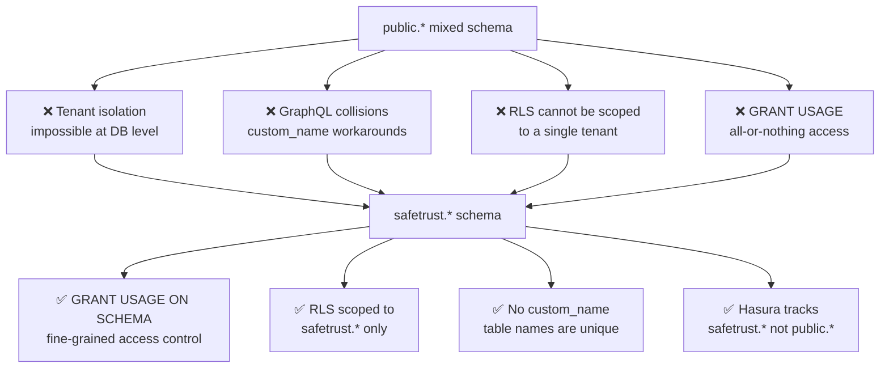
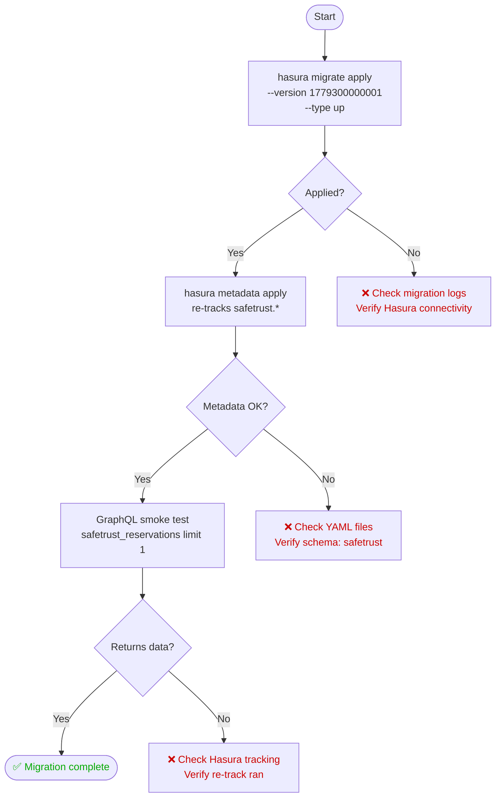
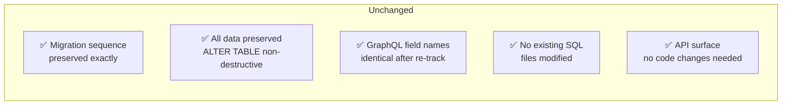

# SafeTrust Schema Migration Strategy

## Why this migration exists

All SafeTrust tables were originally created in the PostgreSQL `public` schema. Migration `1779300000001` moves them to the `safetrust` schema to enforce tenant data isolation at the PostgreSQL permission level.

### Before and after

```mermaid
flowchart LR
    subgraph BEFORE
        PUB[public schema]
        PUB --> A1[public.users]
        PUB --> A2[public.apartments]
        PUB --> A3[public.trustless_work_escrows]
        PUB --> A4[public.escrow_milestones]
        PUB --> A5[public.reservations]
        PUB --> A6[public.roles]
        PUB --> A7[...17 more tables]
    end

    subgraph AFTER
        ST[safetrust schema]
        HI[hotel_industry schema]
        ST --> B1[safetrust.users]
        ST --> B2[safetrust.apartments]
        ST --> B3[safetrust.trustless_work_escrows]
        ST --> B4[safetrust.escrow_milestones]
        ST --> B5[safetrust.reservations]
        HI --> C1[hotel_industry.hotels]
        HI --> C2[hotel_industry.rooms]
        HI --> C3[hotel_industry.reservations]
    end

    BEFORE -->|ALTER TABLE<br/>SET SCHEMA| AFTER
```



## Four reasons for schema separation



## Three-layer escrow hierarchy after migration


## Deployment sequence



### Commands

```bash
# Step 1 — Apply database migration
hasura migrate apply \
  --endpoint http://localhost:8080 \
  --admin-secret myadminsecretkey \
  --database-name safetrust \
  --version 1779300000001 \
  --type up

# Step 2 — Reload Hasura metadata
hasura metadata apply \
  --endpoint http://localhost:8080 \
  --admin-secret myadminsecretkey

# Step 3 — GraphQL smoke test
curl -X POST http://localhost:8080/v1/graphql \
  -H "x-hasura-admin-secret: myadminsecretkey" \
  -H "Content-Type: application/json" \
  -d '{"query": "query { safetrust_reservations(limit: 1) { id } }"}'
```

## Rollback strategy


### Rollback commands

```bash
# Step 1 — Revert migration
hasura migrate apply \
  --endpoint http://localhost:8080 \
  --admin-secret myadminsecretkey \
  --database-name safetrust \
  --version 1779300000001 \
  --type down

# Step 2 — Restore previous metadata
hasura metadata apply \
  --endpoint http://localhost:8080 \
  --admin-secret myadminsecretkey
```

## What was NOT changed



| Item | Status |
|---|---|
| Existing migration files | ✅ Unchanged |
| Data in tables | ✅ Preserved — `ALTER TABLE SET SCHEMA` is non-destructive |
| GraphQL field names | ✅ Identical after Hasura re-tracks under `safetrust.*` |
| Migration sequence | ✅ Preserved |
| Application code | ✅ No changes required |

## Hasura metadata YAML changes

After this migration all table YAML files in `metadata/tenants/safetrust/databases/tables/` must reference `schema: safetrust` instead of `schema: public`:

```yaml
# Before migration
table:
  name: users
  schema: public        # ← old

# After migration
table:
  name: users
  schema: safetrust     # ← new
```

The YAML filenames do NOT change — only the schema field inside.
