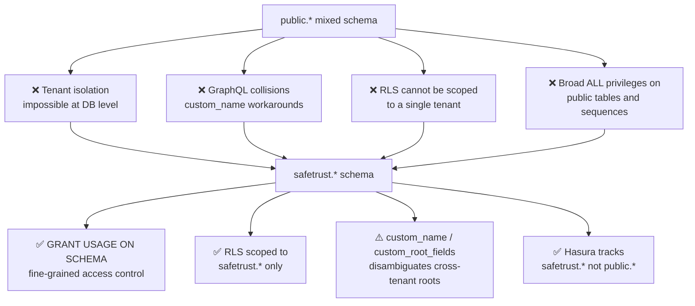
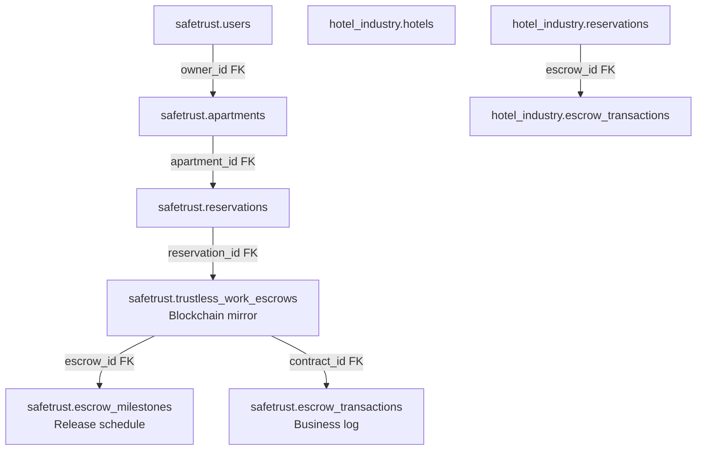
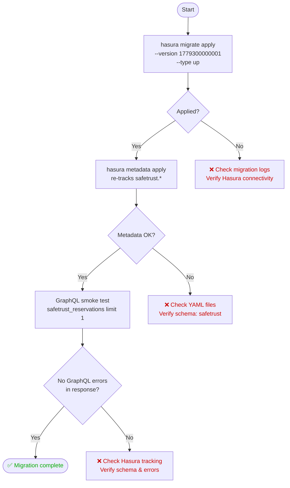
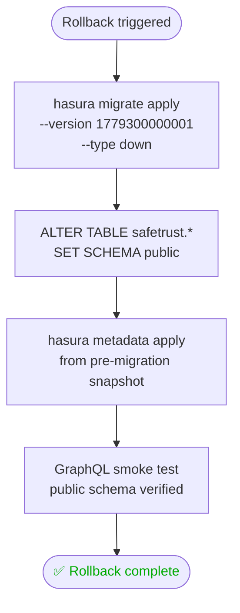
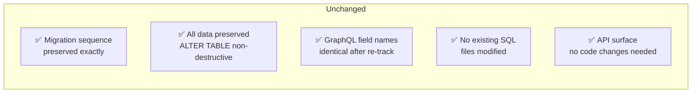

```mermaid
flowchart LR
    subgraph BEFORE
        PUB[public schema]
        PUB --> A1[public.users]
        PUB --> A2[public.apartments]
        PUB --> A3[public.trustless_work_escrows]
        PUB --> A4[public.escrow_milestones]
        PUB --> A5[public.reservations]
        PUB --> A6[public.roles]
        PUB --> A7[...17 more tables]
    end

    subgraph AFTER
        ST[safetrust schema]
        HI[hotel_industry schema]
        ST --> B1[safetrust.users]
        ST --> B2[safetrust.apartments]
        ST --> B3[safetrust.trustless_work_escrows]
        ST --> B4[safetrust.escrow_milestones]
        ST --> B5[safetrust.reservations]
        HI --> C1[hotel_industry.hotels]
        HI --> C2[hotel_industry.rooms]
        HI --> C3[hotel_industry.reservations]
    end

    BEFORE -->|ALTER TABLE<br/>SET SCHEMA| AFTER
```

# 🛡️ SafeTrust Schema Migration Architecture

This document provides a comprehensive technical breakdown of the schema migration from PostgreSQL `public` to the dedicated `safetrust` schema namespace, detailing the architecture, tenant isolation benefits, escrow hierarchy, deployment sequence, and rollback procedures.

---

## 📖 Table of Contents

- [Overview](#overview)
- [Before & After Schema Namespace](#before--after-schema-namespace)
- [Four Reasons for Schema Separation](#four-reasons-for-schema-separation)
- [Three-Layer Escrow Hierarchy](#three-layer-escrow-hierarchy)
- [Non-Destructive Migration Mechanism](#non-destructive-migration-mechanism)
- [Hasura Metadata YAML Configuration](#hasura-metadata-yaml-configuration)
- [Security & Access Control Architecture](#security--access-control-architecture)
- [GraphQL Disambiguation & Custom Root Field Architecture](#graphql-disambiguation--custom-root-field-architecture)
- [Deployment Sequence](#deployment-sequence)
- [Deployment Commands](#deployment-commands)
- [Rollback Strategy & Pre-Migration Backup](#rollback-strategy--pre-migration-backup)
- [Summary of Preserved Components](#summary-of-preserved-components)

---

<a id="overview"></a>
## 🔍 Overview

All SafeTrust database objects (tables, relations, sequences, and stored procedures) were initially created inside PostgreSQL's default `public` schema. As the backend expanded into a multi-tenant platform supporting multiple business domains (such as `safetrust` and `hotel_industry`), segregating database entities into dedicated schema namespaces became essential.

Migration `1779300000001_migrate_to_safetrust_schema` transitions all SafeTrust tables and signature-qualified stored functions from `public` to `safetrust` atomically and non-destructively.

---

<a id="before--after-schema-namespace"></a>
## 🏛️ Before & After Schema Namespace

Prior to the migration, all tenant entities coexisted within the `public` schema, causing namespace competition. After the migration, each tenant operates in its own isolated schema namespace (`safetrust` and `hotel_industry`).



---

<a id="four-reasons-for-schema-separation"></a>
## 🎯 Four Reasons for Schema Separation

Moving from a shared `public` schema to dedicated tenant schemas resolves four primary architectural bottlenecks:

1. **Database-Level Tenant Isolation**: Enforces clean boundaries between distinct product domains.
2. **Elimination of GraphQL Name Collisions**: Disambiguates root query and mutation fields across tenants.
3. **Scoped Row-Level Security (RLS) Foundation**: Provides an isolated schema namespace for configuring table-specific RLS policies.
4. **Fine-Grained Privilege Management**: Enables precise PostgreSQL `GRANT USAGE ON SCHEMA` permissions for runtime roles.



> [!NOTE]
> **RLS vs. Schema Isolation**: Schema separation provides namespace boundary isolation via `GRANT USAGE ON SCHEMA`. Row-Level Security (RLS) is an orthogonal, table-level feature: it requires enabling RLS per table (`ALTER TABLE safetrust.<table_name> ENABLE ROW LEVEL SECURITY`) and defining granular rules (`CREATE POLICY ... ON safetrust.<table_name>`). The schema migration establishes the isolated namespace foundation, allowing RLS policies to be scoped cleanly to `safetrust.*` tables without cross-tenant side effects.
>
> **Schema Privileges & Grants (Node P4)**: `GRANT USAGE ON SCHEMA safetrust` grants schema usage, not table or sequence access. The migration grants schema `USAGE` separately from `ALL` privileges on tables and sequences. The migration script must execute explicit `GRANT` commands for tables (`GRANT ALL ON ALL TABLES IN SCHEMA safetrust TO ...`) and sequences (`GRANT ALL ON ALL SEQUENCES IN SCHEMA safetrust TO ...`), alongside revoking default public schema privileges (`REVOKE ALL ON ALL TABLES IN SCHEMA public FROM ...`).
>
> **Root Field Mapping Limitation (Node R3)**: The metadata sets `custom_name: safetrust_reservations` and `custom_name: hotel_reservations` for the colliding `reservations` tables. When `custom_name` is set without `custom_root_fields`, Hasura auto-generates root operations prefixed by that name (e.g., `update_safetrust_reservations`, `update_safetrust_reservations_by_pk`). Webhook handlers and client mutations should either target these generated operation names or define explicit `custom_root_fields` mappings.

---

<a id="three-layer-escrow-hierarchy"></a>
## 🔐 Three-Layer Escrow Hierarchy

SafeTrust models on-chain Stellar smart contracts and rental operations through a three-layer escrow hierarchy. This structure decouples the on-chain contract state from the milestone schedule and transactional audit logs, while establishing clear foreign key relationships with users, apartments, and reservations.



### Hierarchy & Foreign Key Breakdown:

1. **Blockchain Mirror Layer (`safetrust.trustless_work_escrows`)**:
   Reflects the live state of TrustlessWork Stellar escrow contracts, storing contract IDs, engagement status, client/service provider public keys, and deposit balances.
2. **Release Schedule Layer (`safetrust.escrow_milestones`)**:
   Tracks programmatic milestone releases, approval flags, and payout distributions.
   - `escrow_milestones.escrow_id` contains a database foreign key constraint referencing `safetrust.trustless_work_escrows.id` (`ON DELETE CASCADE`).
3. **Business Log Layer (`safetrust.escrow_transactions`)**:
   Maintains immutable transactional ledger entries for all deposit, release, dispute, and refund events.
   - `escrow_transactions.contract_id` records the Stellar contract ID matching `safetrust.trustless_work_escrows.contract_id` as an on-chain ledger reference.
4. **Domain Relationships**:
   - `safetrust.users.id` is referenced by `safetrust.apartments.user_id` / `owner_id`.
   - `safetrust.apartments.id` is referenced by `safetrust.reservations.apartment_id` (`apartment_id FK`).
   - `safetrust.reservations.escrow_id` / `reservation_id` connects reservations to escrow instances.
   - `hotel_industry.reservations.escrow_id` is an FK referencing `hotel_industry.escrow_transactions.id` within the `hotel_industry` schema.

---

<a id="non-destructive-migration-mechanism"></a>
## ⚙️ Non-Destructive Migration Mechanism

The migration executes using standard PostgreSQL `ALTER TABLE ... SET SCHEMA` and signature-qualified `ALTER FUNCTION ... SET SCHEMA` commands.

### Table Transitions
All 20 SafeTrust tables are moved between schemas:
- Core tables: `users`, `user_wallets`, `roles`, `user_roles`, `trustless_work_escrows`, `trustless_work_webhook_events`, `escrow_milestones`, `escrow_transactions`, `apartments`, `apartment_images`, `reservations`, `bid_requests`, `pricing_rules`, `pricing_overrides`, `conversations`, `messages`.
- Analytics & helper tables (using `IF EXISTS`): `bid_status_histories`, `escrow_pending_approvals`, `escrow_analytics_by_day`, `escrow_status_summary`.

### Function Relocations
The migration moves six stored procedures between schemas using explicit signature qualifications in both `up.sql` and `down.sql`:

```sql
-- Migration up (public -> safetrust)
ALTER FUNCTION IF EXISTS public.find_nearby_apartments(double precision, double precision, double precision) SET SCHEMA safetrust;
ALTER FUNCTION IF EXISTS public.find_apartments_by_owner(uuid) SET SCHEMA safetrust;
ALTER FUNCTION IF EXISTS public.search_apartments(text, text, numeric, numeric, text) SET SCHEMA safetrust;
ALTER FUNCTION IF EXISTS public.get_apartments_in_bounds(double precision, double precision, double precision, double precision) SET SCHEMA safetrust;
ALTER FUNCTION IF EXISTS public.get_escrow_analytics_by_day(date, date) SET SCHEMA safetrust;
ALTER FUNCTION IF EXISTS public.get_escrow_status_summary() SET SCHEMA safetrust;

-- Migration down (safetrust -> public)
ALTER FUNCTION IF EXISTS safetrust.find_nearby_apartments(double precision, double precision, double precision) SET SCHEMA public;
ALTER FUNCTION IF EXISTS safetrust.find_apartments_by_owner(uuid) SET SCHEMA public;
ALTER FUNCTION IF EXISTS safetrust.search_apartments(text, text, numeric, numeric, text) SET SCHEMA public;
ALTER FUNCTION IF EXISTS safetrust.get_apartments_in_bounds(double precision, double precision, double precision, double precision) SET SCHEMA public;
ALTER FUNCTION IF EXISTS safetrust.get_escrow_analytics_by_day(date, date) SET SCHEMA public;
ALTER FUNCTION IF EXISTS safetrust.get_escrow_status_summary() SET SCHEMA public;
```

### Physical Storage & Locking Characteristics:
- **Catalog-Only Modification**: In PostgreSQL, altering an object's schema simply updates the namespace OID (`pg_class.relnamespace` for tables, `pg_proc.pronamespace` for functions) in the system catalog metadata.
- **Zero Disk Rewrites**: No heap files, data blocks, indexes, sequences, or constraints are moved, modified, or rewritten on physical disk storage.
- **Integrity Preservation**: All primary keys, foreign keys, unique constraints, check constraints, default expressions, triggers, and secondary indexes remain completely valid and intact.
- **Locking Considerations (`ACCESS EXCLUSIVE`)**: `ALTER TABLE ... SET SCHEMA` acquires an `ACCESS EXCLUSIVE` lock on each table being relocated. This lock conflicts with all other lock modes (including read queries via `ACCESS SHARE`). While the catalog update completes in milliseconds within a single transaction, it will queue behind active long-running queries and will temporarily block concurrent reads and writes during execution. Deployments should be scheduled during low-traffic maintenance windows.

---

<a id="hasura-metadata-yaml-configuration"></a>
## 📄 Hasura Metadata YAML Configuration

When tables transition schemas in PostgreSQL, Hasura requires updated metadata configuration so it tracks the tables under their new schema namespace.

### YAML Schema Definition Change

Each tracked table's metadata file updates its `table.schema` property from `public` to `safetrust`:

```yaml
# Before migration
table:
  name: users
  schema: public        # ← old

# After migration
table:
  name: users
  schema: safetrust     # ← new
```

### What YAML Filenames Change vs. What Stays the Same:
- **Table Definition Filenames (Unchanged)**:
  - Table-definition files (e.g. `metadata/tenants/safetrust/databases/tables/public_trustless_work_escrows.yaml`, `public_users.yaml`, etc.) retain their canonical file names in the repository to maintain stable file paths and ensure backward-compatible includes in `tables.yaml`.
  - The internal content of each file updates its `table.schema` field from `public` to `safetrust`.
- **Index and Build Paths**:
  - `metadata/tenants/safetrust/databases/tables/tables.yaml` continues to include the YAML files via `!include public_<table_name>.yaml`.
  - During deployment, `metadata/build-metadata.sh` merges tenant configurations into `metadata/build/safetrust/databases/databases.yaml`, producing the final metadata payload that Hasura applies to track `safetrust.<table_name>`.
- **Relationships & Permissions (Preserved)**:
  - Relationship names (`object_relationships` and `array_relationships`) retain identical names and join fields.
  - Permission rules (`select_permissions`, `insert_permissions`, `update_permissions`, `delete_permissions`) and filter definitions remain unchanged.
  - Custom column descriptions and comment annotations are preserved.

> [!IMPORTANT]
> The spatial tables `public_geography_columns`, `public_geometry_columns`, and `public_spatial_ref_sys` were NOT moved by migration `1779300000001` and remain on `schema: public`.

---

<a id="security--access-control-architecture"></a>
## 🛡️ Security & Access Control Architecture

In standard PostgreSQL deployments, the `public` schema has default permissions that allow all roles to connect and create objects unless aggressively restricted.

### Role Separation & Least Privilege

Production database access enforces a strict separation between migration roles and runtime application roles:

- **Migration Role (`safetrust_admin`)**: Used by Hasura CLI and migration runners with DDL privileges to create schemas, alter tables, and manage metadata.
- **Runtime Application Role (`safetrust_user`)**: Used by Hasura GraphQL Engine and webhook services, granted least-privilege DML permissions restricted exclusively to the `safetrust` schema.

```sql
-- 1. Schema-Level Access for Runtime Role
GRANT USAGE ON SCHEMA safetrust TO safetrust_user;

-- 2. Granular Table and Sequence Permissions
GRANT SELECT, INSERT, UPDATE, DELETE ON ALL TABLES IN SCHEMA safetrust TO safetrust_user;
GRANT USAGE, SELECT ON ALL SEQUENCES IN SCHEMA safetrust TO safetrust_user;

-- 3. Deterministic Default Privileges for Future Migrations
ALTER DEFAULT PRIVILEGES FOR ROLE safetrust_admin IN SCHEMA safetrust
  GRANT SELECT, INSERT, UPDATE, DELETE ON TABLES TO safetrust_user;
ALTER DEFAULT PRIVILEGES FOR ROLE safetrust_admin IN SCHEMA safetrust
  GRANT USAGE, SELECT ON SEQUENCES TO safetrust_user;
```

### Multi-Tenant Protection:
Because `safetrust_user` is granted `USAGE` strictly on `SCHEMA safetrust`, it has zero visibility into `hotel_industry` or other tenant schemas. Even if a runtime service were compromised, cross-tenant data queries are rejected at the PostgreSQL permission layer.

*(Note: In local Docker development environments, the `postgres` superuser is used for unified container initialization, whereas production environments enforce the distinct `safetrust_admin` and `safetrust_user` role boundaries above).*

---

<a id="graphql-disambiguation--custom-root-field-architecture"></a>
## 🚫 GraphQL Disambiguation & Custom Root Field Architecture

When multiple database sources or schemas are exposed through a single unified Hasura endpoint, tables that share identical names across tenants (such as `reservations` in `safetrust` and `reservations` in `hotel_industry`) require explicit naming disambiguation in the Hasura metadata.

### Custom Name & Root Field Mapping:
- **Disambiguation via `custom_name`**: In `metadata/tenants/safetrust/databases/tables/public_reservations.yaml`, `custom_name: safetrust_reservations` is defined (and `hotel_reservations` in Hotel Industry).
- **Generated GraphQL Root Operations**: By default, Hasura derives queries and mutations from the configured `custom_name`:
  - Query: `safetrust_reservations`, `safetrust_reservations_by_pk`, `safetrust_reservations_aggregate`
  - Mutation: `insert_safetrust_reservations`, `update_safetrust_reservations`, `update_safetrust_reservations_by_pk`, `delete_safetrust_reservations`
- **Reconciling Webhook Handlers & Consumers**: Handlers and webhook mutation queries should use the generated `update_safetrust_reservations` / `update_safetrust_reservations_by_pk` names, or explicitly define `custom_root_fields` in the metadata table configuration:

```yaml
table:
  name: reservations
  schema: safetrust
configuration:
  custom_name: safetrust_reservations
  custom_root_fields:
    select: safetrust_reservations
    select_by_pk: safetrust_reservations_by_pk
    select_aggregate: safetrust_reservations_aggregate
    insert: insert_safetrust_reservations
    insert_one: insert_safetrust_reservations_one
    update: update_safetrust_reservations
    update_by_pk: update_safetrust_reservations_by_pk
    delete: delete_safetrust_reservations
    delete_by_pk: delete_safetrust_reservations_by_pk
```

---

<a id="deployment-sequence"></a>
## 🚀 Deployment Sequence

The deployment workflow applies the schema migration, updates Hasura metadata tracking, and executes a GraphQL verification smoke test with defined error paths.



---

<a id="deployment-commands"></a>
## 💻 Deployment Commands

Execute the following sequential commands during migration deployment:

```bash
# Step 1 — Apply database migration
hasura migrate apply \
  --endpoint http://localhost:8080 \
  --admin-secret myadminsecretkey \
  --database-name safetrust \
  --version 1779300000001 \
  --type up

# Step 2 — Reload Hasura metadata
hasura metadata apply \
  --endpoint http://localhost:8080 \
  --admin-secret myadminsecretkey

# Step 3 — GraphQL smoke test
curl -X POST http://localhost:8080/v1/graphql \
  -H "x-hasura-admin-secret: myadminsecretkey" \
  -H "Content-Type: application/json" \
  -d '{"query": "query { safetrust_reservations(limit: 1) { id } }"}'
```

---

<a id="rollback-strategy--pre-migration-backup"></a>
## 🔄 Rollback Strategy & Pre-Migration Backup

> [!WARNING]
> Running `hasura metadata apply` during rollback targets the current `metadata/` directory, which already contains `safetrust.*` tables and will not restore `public.*` tracking. A pre-migration metadata snapshot must exist prior to applying migration `1779300000001` in order to restore `public.*` schema tracking.



### Pre-migration Snapshot Backup

Prior to executing the migration, capture a pre-migration metadata snapshot:

```bash
# Step 0 — Export pre-migration metadata snapshot
hasura metadata export \
  --endpoint http://localhost:8080 \
  --admin-secret myadminsecretkey

# Copy exported metadata directory to a backup location
cp -r metadata metadata_backup
```

### Rollback Procedure

```bash
# Step 1 — Revert migration
hasura migrate apply \
  --endpoint http://localhost:8080 \
  --admin-secret myadminsecretkey \
  --database-name safetrust \
  --version 1779300000001 \
  --type down

# Step 2 — Restore pre-migration metadata snapshot
cp -r metadata_backup/* metadata/
hasura metadata apply \
  --endpoint http://localhost:8080 \
  --admin-secret myadminsecretkey
```

---

<a id="summary-of-preserved-components"></a>
## ✅ Summary of Preserved Components

The schema namespace migration non-destructively reorganizes catalog metadata while preserving application integrity.



| Item | Status |
|---|---|
| Existing migration files | ✅ Unchanged |
| Data in tables | ✅ Preserved — `ALTER TABLE SET SCHEMA` is non-destructive |
| GraphQL field names | ✅ Identical after Hasura re-tracks under `safetrust.*` |
| Migration sequence | ✅ Preserved |
| Application code | ✅ No changes required |
