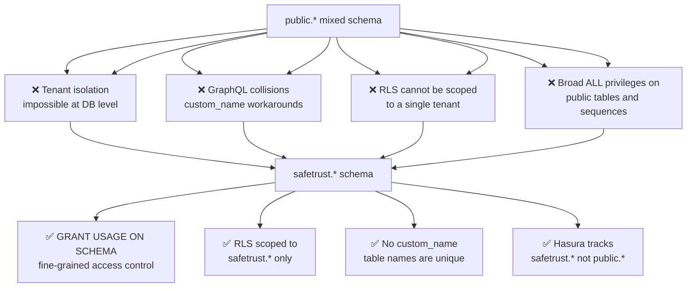
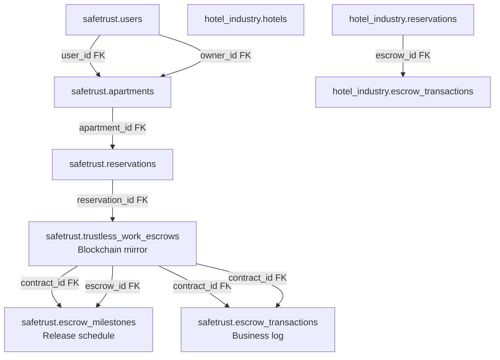
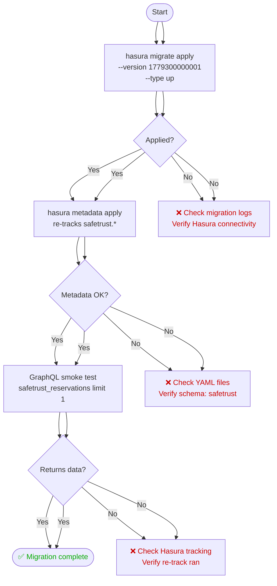
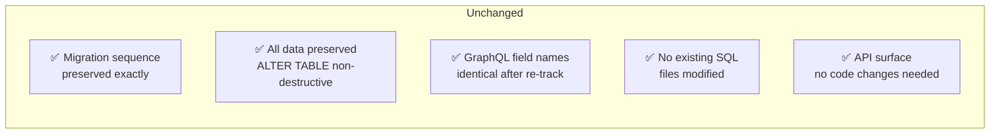

# SafeTrust Schema Migration Strategy

> Migration `1779300000001_migrate_to_safetrust_schema` — moves every SafeTrust
> table out of the PostgreSQL `public` schema and into a dedicated `safetrust`
> schema.

## Table of Contents

- [Why this migration exists](#why-this-migration-exists)
- [Four reasons for schema separation](#four-reasons-for-schema-separation)
- [Three-layer escrow hierarchy after migration](#three-layer-escrow-hierarchy-after-migration)
- [Deployment sequence](#deployment-sequence)
- [Rollback strategy](#rollback-strategy)
- [What was NOT changed](#what-was-not-changed)
- [Hasura metadata YAML changes](#hasura-metadata-yaml-changes)

---

## Why this migration exists

All SafeTrust tables were originally created in the PostgreSQL `public` schema.
Migration `1779300000001` moves them to the `safetrust` schema to enforce tenant
data isolation at the PostgreSQL permission level.

`public` is the default schema every PostgreSQL role can reach, so as long as
SafeTrust lived there, "which tenant owns this table?" was a naming convention
rather than something the database could enforce. Once the tables live in
`safetrust`, the boundary becomes a real permission boundary: a role that was
never granted `USAGE ON SCHEMA safetrust` cannot see the tables at all.
## Why this migration exists

All SafeTrust tables were originally created in the PostgreSQL `public` schema. Migration `1779300000001` moves them to the `safetrust` schema to enforce tenant data isolation at the PostgreSQL permission level.

### Before and after

```mermaid
flowchart LR
    subgraph BEFORE
        PUB[public schema]
        PUB --> A1[public.users]
        PUB --> A2[public.apartments]
        PUB --> A3[public.trustless_work_escrows]
        PUB --> A4[public.escrow_milestones]
        PUB --> A5[public.reservations]
        PUB --> A6[public.roles]
        PUB --> A7[...17 more tables]
    end

    subgraph AFTER
        ST[safetrust schema]
        HI[hotel_industry schema]
        ST --> B1[safetrust.users]
        ST --> B2[safetrust.apartments]
        ST --> B3[safetrust.trustless_work_escrows]
        ST --> B4[safetrust.escrow_milestones]
        ST --> B5[safetrust.reservations]
        HI --> C1[hotel_industry.hotels]
        HI --> C2[hotel_industry.rooms]
        HI --> C3[hotel_industry.reservations]
    end

    BEFORE -->|ALTER TABLE<br/>SET SCHEMA| AFTER
```



### Why `ALTER TABLE ... SET SCHEMA` is non-destructive

`ALTER TABLE ... SET SCHEMA` only rewrites the table's catalog entry — the
`pg_class.relnamespace` pointer that says which schema the table belongs to. It
does not copy, rewrite, or re-create any rows:

- **Data is untouched.** No `INSERT`, no `SELECT INTO`, no table rewrite. The
  heap files stay exactly where they were.
- **Indexes, constraints, sequences, and triggers follow the table.** Owned
  objects move with their parent, so primary keys and foreign keys stay intact.
- **It is transactional.** The whole migration runs inside one transaction, so
  either every table lands in `safetrust` or none of them do.
- **It is reversible.** `down.sql` runs the same statement in the opposite
  direction — see [Rollback strategy](#rollback-strategy).

The migration also adds `safetrust` to the role's `search_path`, so unqualified
queries written against the old layout keep resolving during the transition:

```sql
ALTER ROLE CURRENT_USER SET search_path TO safetrust, public;
```

---

    BEFORE -->|ALTER TABLE<br/>SET SCHEMA| AFTER
```

## Four reasons for schema separation



### 1. `GRANT USAGE ON SCHEMA safetrust` enables fine-grained access control

With everything in `public`, access control was all-or-nothing. Every role in a
PostgreSQL database can reach `public` by default, so the only lever left was
per-table `GRANT`/`REVOKE` — which has to be re-applied every time a migration
adds a table, and silently leaves new tables exposed when someone forgets.

A dedicated schema turns access into a two-level decision:

```sql
-- Reach the namespace at all
GRANT USAGE ON SCHEMA safetrust TO postgres;

-- Then, and only then, reach objects inside it
GRANT ALL ON ALL TABLES    IN SCHEMA safetrust TO postgres;
GRANT ALL ON ALL SEQUENCES IN SCHEMA safetrust TO postgres;

-- Future tables inherit the same grants automatically
ALTER DEFAULT PRIVILEGES IN SCHEMA safetrust
  GRANT ALL ON TABLES TO postgres;
```

A role without `USAGE ON SCHEMA safetrust` cannot touch a single object in it,
no matter what table-level grants exist. That is the guarantee `public` could
never give, and `ALTER DEFAULT PRIVILEGES` makes it hold for tables that do not
exist yet.

### 2. Row-level security can be scoped to one tenant

RLS policies are written per table, but the decision of *which* tables belong to
a tenant is what makes a policy set reviewable. With `safetrust.*` as the unit,
"enable RLS on every SafeTrust table" is a single, auditable sweep over one
schema instead of a hand-maintained list of table names inside `public`.

### 3. GraphQL `custom_name` workarounds are eliminated

Hasura derives GraphQL root fields from the table name. While SafeTrust lived in
`public`, a table name was the *only* thing separating it from a same-named
table on the other tenant — SafeTrust and `hotel_industry` both define
`reservations` — so the only way to keep root fields unambiguous was to rename
them by hand in metadata:

```yaml
table:
  name: reservations
  schema: public
configuration:
  custom_name: safetrust_reservations   # ← manual collision avoidance
```

Every new table carried the risk of a fresh collision, and the fix had to be
remembered each time.

After the move the namespace does that work: `safetrust.reservations` and
`hotel_industry.reservations` are distinct tables in distinct schemas, tracked
by two separate Hasura sources. Table names are unique per schema, so **new
tables no longer need a `custom_name` to stay unambiguous.**

The existing `custom_name: safetrust_reservations` is kept deliberately: it is
now an API-compatibility guarantee rather than a workaround. Dropping it would
rename the root field from `safetrust_reservations` to `reservations` and break
every existing client query — including the smoke test in
[Deployment sequence](#deployment-sequence). The workaround is eliminated going
forward, not retroactively removed.

### 4. Hasura tracks `safetrust.*`, not `public.*`

Tracking a specific schema means Hasura's source definition matches the tenant
boundary. Anything left in `public` — PostGIS views such as
`geography_columns`, `geometry_columns`, and `spatial_ref_sys` — is visibly
*not* SafeTrust data, instead of being indistinguishable from it.

---
    FIX --> R1[✅ GRANT USAGE ON SCHEMA<br/>fine-grained access control]
    FIX --> R2[✅ RLS scoped to<br/>safetrust.* only]
    FIX --> R3[⚠️ custom_name active without custom_root_fields<br/>webhook update_reservations mismatch]
    FIX --> R4[✅ Hasura tracks<br/>safetrust.* not public.*]
```

> [!NOTE]
> **Schema Privileges & Grants (Node P4)**: `GRANT USAGE ON SCHEMA safetrust` grants schema usage, not table or sequence access. The migration grants schema `USAGE` separately from `ALL` privileges on tables and sequences. The migration script must execute explicit `GRANT` commands for tables (`GRANT ALL ON ALL TABLES IN SCHEMA safetrust TO ...`) and sequences (`GRANT ALL ON ALL SEQUENCES IN SCHEMA safetrust TO ...`), alongside revoking default public schema privileges (`REVOKE ALL ON ALL TABLES IN SCHEMA public FROM ...`).

> [!NOTE]
> **Root Field Mapping Limitation (Node R3)**: The metadata sets `custom_name: safetrust_reservations` and `custom_name: hotel_reservations` without `custom_root_fields`. Hasura generates root operations derived from those custom names (e.g. `update_safetrust_reservations`) while webhook handlers still call `update_reservations`. A `custom_root_fields` mapping fix is required to map root operations back to expected field names.

## Three-layer escrow hierarchy after migration



The three escrow layers stay in the same relative order they had in `public` —
only their namespace changed:

| Layer | Table | Role |
|---|---|---|
| 1 | `safetrust.trustless_work_escrows` | Mirror of the on-chain Soroban contract state |
| 2 | `safetrust.escrow_milestones` | Release schedule keyed by `contract_id` |
| 3 | `safetrust.escrow_transactions` | SafeTrust business log keyed by `contract_id` |

`hotel_industry` keeps its own escrow log (`hotel_industry.escrow_transactions`)
reached through `hotel_industry.reservations`. The two tenants never cross a
foreign key, which is exactly the isolation the schema split makes enforceable.

---

## Deployment sequence



### Commands

```bash
# Step 1 — Apply database migration
hasura migrate apply \
  --endpoint http://localhost:8080 \
  --admin-secret myadminsecretkey \
  --database-name safetrust \
  --version 1779300000001 \
  --type up

# Step 2 — Reload Hasura metadata
hasura metadata apply \
  --endpoint http://localhost:8080 \
  --admin-secret myadminsecretkey

# Step 3 — GraphQL smoke test
curl -X POST http://localhost:8080/v1/graphql \
  -H "x-hasura-admin-secret: myadminsecretkey" \
  -H "Content-Type: application/json" \
  -d '{"query": "query { safetrust_reservations(limit: 1) { id } }"}'
```

> `myadminsecretkey` is the local default from `.env.example`
> (`HASURA_GRAPHQL_ADMIN_SECRET`). Use your own secret outside local
> development — and never expose it to the frontend.

### How this maps to `bin/start`

`bin/start safetrust hotel_industry` already performs this sequence as part of
a full stack bring-up; the commands above are the isolated equivalent for
applying only this one migration to a running stack.

| Step above | `bin/start` equivalent |
|---|---|
| Step 1 — `migrate apply --version 1779300000001` | `hasura migrate apply --database-name <tenant>` (applies every pending version) |
| Step 2 — `metadata apply` | `metadata/setup-tenant.sh <tenant>` (build + deploy), then `hasura metadata reload` |
| Step 3 — smoke test | Manual — run it after `bin/start` finishes |

`bin/start` is unchanged by this migration: it applies migrations per tenant,
deploys tenant metadata, reloads metadata, and applies seeds, in that order.

---

## Rollback strategy

```mermaid
flowchart TD
    A([Rollback triggered]) --> B[hasura migrate apply\n--version 1779300000001\n--type down]
    B --> C[ALTER TABLE safetrust.*\nSET SCHEMA public]
    C --> D[hasura metadata apply\nre-tracks public.*]
    D --> E[GraphQL smoke test\npublic schema verified]
## Rollback strategy

> [!WARNING]
> Running `hasura metadata apply` during rollback targets the current `metadata/` directory, which already contains `safetrust.*` tables and will not restore `public.*` tracking. A pre-migration metadata snapshot must exist prior to applying migration `1779300000001` in order to restore `public.*` schema tracking.

```mermaid
flowchart TD
    A([Rollback triggered]) --> B[hasura migrate apply<br/>--version 1779300000001<br/>--type down]
    B --> C[ALTER TABLE safetrust.*<br/>SET SCHEMA public]
    C --> D[hasura metadata apply<br/>from pre-migration snapshot]
    D --> E[GraphQL smoke test<br/>public schema verified]
    E --> F([✅ Rollback complete])

    style F color:#00aa00
```

### Rollback commands
### Pre-migration Snapshot Backup

Prior to executing the migration, capture a pre-migration metadata snapshot:

```bash
# Step 0 — Export pre-migration metadata snapshot
hasura metadata export \
  --endpoint http://localhost:8080 \
  --admin-secret myadminsecretkey \
  --output-dir metadata_backup
```

### Rollback procedure

```bash
# Step 1 — Revert migration
hasura migrate apply \
  --endpoint http://localhost:8080 \
  --admin-secret myadminsecretkey \
  --database-name safetrust \
  --version 1779300000001 \
  --type down

# Step 2 — Restore previous metadata
hasura metadata apply \
  --endpoint http://localhost:8080 \
  --admin-secret myadminsecretkey
```

`down.sql` mirrors `up.sql` statement for statement: every table and function
moves back with `SET SCHEMA public`, `search_path` is reset to `public`, and the
now-empty `safetrust` schema is dropped. Because the down path is also just
catalog updates, the rollback preserves data exactly as the forward migration
does.

> **Order matters.** Revert the migration *before* re-applying metadata. Metadata
> that still says `schema: safetrust` cannot be applied against a database where
> the tables have already moved back to `public`, and vice versa.

---

# Step 2 — Restore pre-migration metadata snapshot
hasura metadata apply \
  --endpoint http://localhost:8080 \
  --admin-secret myadminsecretkey \
  --project metadata_backup
```

## What was NOT changed



| Item | Status |
|---|---|
| Existing migration files | ✅ Unchanged |
| Data in tables | ✅ Preserved — `ALTER TABLE SET SCHEMA` is non-destructive |
| GraphQL field names | ✅ Identical after Hasura re-tracks under `safetrust.*` |
| Migration sequence | ✅ Preserved |
| Application code | ✅ No changes required |

No earlier migration was edited or renumbered. The schema move is an additive
version at the end of the sequence, so a fresh database and an existing one
converge on the same final state.

---

## Hasura metadata YAML changes

After this migration all table YAML files in
`metadata/tenants/safetrust/databases/tables/` must reference `schema: safetrust`
instead of `schema: public`:
## Hasura metadata YAML changes

Only tables actually moved by migration `1779300000001` change to `schema: safetrust`. After this migration, table YAML files in `metadata/tenants/safetrust/databases/tables/` for moved tables reference `schema: safetrust` instead of `schema: public`:

```yaml
# Before migration
table:
  name: users
  schema: public        # ← old

# After migration
table:
  name: users
  schema: safetrust     # ← new
```

The YAML filenames do NOT change — only the schema field inside.

### What changes vs what stays the same

| Item | Changes? | Notes |
|---|---|---|
| `schema:` field in table YAML | ✅ Changes | `public` → `safetrust` |
| `schema:` inside relationship targets | ✅ Changes | Both sides of every FK relationship |
| YAML filenames (`public_users.yaml`) | ❌ Unchanged | The `public_` prefix is a filename convention, not a schema reference |
| `tables.yaml` include list | ❌ Unchanged | It lists filenames, which did not change |
| Table names inside YAML | ❌ Unchanged | `users` is still `users` |
| PostGIS view entries | ❌ Unchanged | `geography_columns`, `geometry_columns`, and `spatial_ref_sys` stay in `public` |
| GraphQL root fields | ❌ Unchanged | Field names are identical after re-tracking |

Renaming the files would be a separate, larger diff with no functional benefit —
Hasura reads the `schema:` field, not the filename. Leaving the names alone
keeps this migration's metadata diff to the one line per file that actually
matters.
The YAML filenames do NOT change — only the `schema` field inside for moved tables.

> [!IMPORTANT]
> The spatial tables `public_geography_columns`, `public_geometry_columns`, and `public_spatial_ref_sys` were NOT moved by migration `1779300000001` and remain on `schema: public`.

