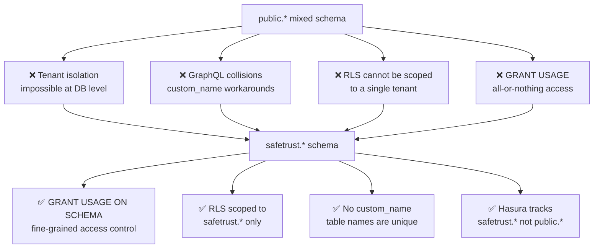
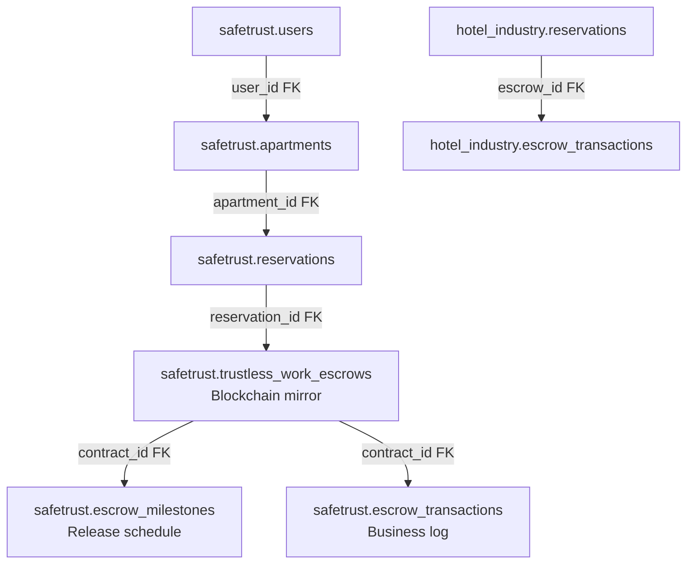
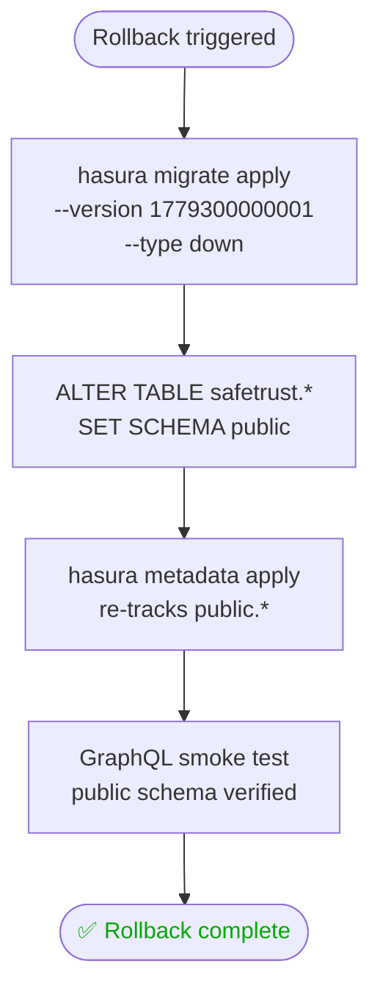
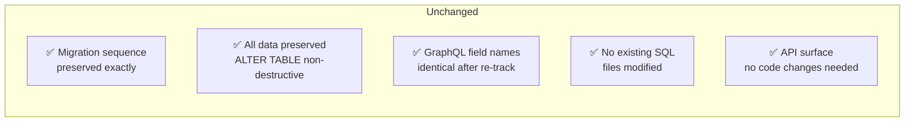

```mermaid
flowchart LR
    subgraph BEFORE
        PUB[public schema]
        PUB --> A1[public.users]
        PUB --> A2[public.apartments]
        PUB --> A3[public.trustless_work_escrows]
        PUB --> A4[public.escrow_milestones]
        PUB --> A5[public.reservations]
        PUB --> A6[public.roles]
        PUB --> A7[...17 more tables]
    end

    subgraph AFTER
        ST[safetrust schema]
        HI[hotel_industry schema]
        ST --> B1[safetrust.users]
        ST --> B2[safetrust.apartments]
        ST --> B3[safetrust.trustless_work_escrows]
        ST --> B4[safetrust.escrow_milestones]
        ST --> B5[safetrust.reservations]
        HI --> C1[hotel_industry.hotels]
        HI --> C2[hotel_industry.rooms]
        HI --> C3[hotel_industry.reservations]
    end

    BEFORE -->|ALTER TABLE<br/>SET SCHEMA| AFTER
```

# 🛡️ SafeTrust Schema Migration Architecture

This document provides a comprehensive technical breakdown of the schema migration from PostgreSQL `public` to the dedicated `safetrust` schema namespace, detailing the architecture, tenant isolation benefits, escrow hierarchy, deployment sequence, and rollback procedures.

---

## 📖 Table of Contents

- [Overview](#-overview)
- [Before & After Schema Namespace](#-before--after-schema-namespace)
- [Why Schema Separation Matters](#-why-schema-separation-matters)
- [Three-Layer Escrow Hierarchy](#-three-layer-escrow-hierarchy)
- [Non-Destructive Migration Mechanism](#-non-destructive-migration-mechanism)
- [Hasura Metadata YAML Configuration](#-hasura-metadata-yaml-configuration)
- [Security & Access Control Architecture](#-security--access-control-architecture)
- [Elimination of GraphQL Custom Name Workarounds](#-elimination-of-graphql-custom-name-workarounds)
- [Deployment Sequence](#-deployment-sequence)
- [Deployment Commands](#-deployment-commands)
- [Rollback Strategy](#-rollback-strategy)
- [Rollback Commands](#-rollback-commands)
- [Summary of Preserved Components](#-summary-of-preserved-components)

---

## 🔍 Overview

All SafeTrust database objects (tables, relations, sequences, and stored procedures) were initially created inside PostgreSQL's default `public` schema. As the backend expanded into a multi-tenant platform supporting multiple business domains (such as `safetrust` and `hotel_industry`), segregating database entities into dedicated schema namespaces became essential.

Migration `1779300000001_migrate_to_safetrust_schema` transitions all SafeTrust tables and functions from `public` to `safetrust` atomically and non-destructively.

---

## 🏛️ Before & After Schema Namespace

Prior to the migration, all tenant entities coexisted within the `public` schema, causing namespace competition. After the migration, each tenant operates in its own isolated schema namespace (`safetrust` and `hotel_industry`).



---

## 🎯 Why Schema Separation Matters

Moving from a shared `public` schema to dedicated tenant schemas resolves four primary architectural bottlenecks:

1. **Database-Level Tenant Isolation**: Enforces clean boundaries between distinct product domains.
2. **Elimination of GraphQL Name Collisions**: Avoids conflicting root query and mutation fields.
3. **Scoped Row-Level Security (RLS)**: Allows security policies tailored specifically to `safetrust.*`.
4. **Fine-Grained Privilege Management**: Enables precise PostgreSQL `GRANT USAGE ON SCHEMA` permissions.



---

## 🔐 Three-Layer Escrow Hierarchy

SafeTrust models on-chain Stellar smart contracts and rental operations through a robust three-layer escrow hierarchy. This structure decouples the on-chain contract state from the milestone schedule and transactional audit logs, while establishing clear foreign key relationships with users, apartments, and reservations.



### Hierarchy Breakdown:

1. **Blockchain Mirror Layer (`safetrust.trustless_work_escrows`)**:
   Reflects the live state of TrustlessWork Stellar escrow contracts, storing contract IDs, engagement status, client/service provider public keys, and deposit balances.
2. **Release Schedule Layer (`safetrust.escrow_milestones`)**:
   Tracks programmatic milestone releases, approval flags, and payout distributions tied to the escrow contract via `contract_id`.
3. **Business Log Layer (`safetrust.escrow_transactions`)**:
   Maintains immutable transactional ledger entries for all deposit, release, dispute, and refund events linked via `contract_id`.
4. **Domain Relationships**:
   - `safetrust.users` owns `safetrust.apartments` (`user_id` FK).
   - `safetrust.apartments` links to `safetrust.reservations` (`apartment_id` FK).
   - `safetrust.reservations` links to `safetrust.trustless_work_escrows` (`reservation_id` FK).
   - `hotel_industry.reservations` links to `hotel_industry.escrow_transactions` (`escrow_id` FK) in its own isolated schema.

---

## ⚙️ Non-Destructive Migration Mechanism

The migration executes using standard PostgreSQL `ALTER TABLE ... SET SCHEMA` commands.

### Why `ALTER TABLE ... SET SCHEMA` is Non-Destructive:
- **Catalog-Only Modification**: In PostgreSQL, altering a table's schema simply updates the namespace OID (`pg_class.relnamespace`) in the system catalog metadata.
- **Zero Disk Rewrites**: No heap files, data blocks, indexes, sequences, or constraints are moved, modified, or rewritten on physical storage.
- **Integrity Preservation**: All primary keys, foreign keys, unique constraints, check constraints, default expressions, triggers, and secondary indexes remain completely valid and intact.
- **Atomic Execution**: The migration runs within a single transactional block, ensuring zero downtime and complete consistency.

---

## 📄 Hasura Metadata YAML Configuration

When tables transition schemas in PostgreSQL, Hasura requires updated metadata configuration so it tracks the tables under their new schema namespace.

### YAML Schema Definition Change

Each tracked table's metadata file updates its `table.schema` property from `public` to `safetrust`:

```yaml
# Before migration
table:
  name: users
  schema: public  # ← old

# After migration
table:
  name: users
  schema: safetrust  # ← new
```

### What YAML Filenames Change vs. What Stays the Same:
- **What Changes**:
  - The `schema` field inside table definition files is updated to `safetrust`.
  - The `tables.yaml` index references the table definitions under the `safetrust` schema.
  - Database tracking entries point Hasura GraphQL Engine to inspect `safetrust.<table_name>`.
- **What Stays the Same**:
  - Relationship names (`object_relationships` and `array_relationships`) retain identical names and join fields.
  - Permission rules (`select_permissions`, `insert_permissions`, `update_permissions`, `delete_permissions`) and filter definitions remain unchanged.
  - Custom column descriptions and comment annotations are preserved.

---

## 🛡️ Security & Access Control Architecture

In standard PostgreSQL deployments, the `public` schema has default permissions that allow all roles to connect and create objects unless aggressively restricted.

### Benefits of `GRANT USAGE ON SCHEMA safetrust`:
1. **Schema-Level Isolation**: Access can be granted or revoked at the schema boundary:
   ```sql
   GRANT USAGE ON SCHEMA safetrust TO postgres;
   GRANT ALL ON ALL TABLES IN SCHEMA safetrust TO postgres;
   GRANT ALL ON ALL SEQUENCES IN SCHEMA safetrust TO postgres;
   ```
2. **Multi-Tenant Protection**: A tenant database role granted access exclusively to `safetrust` cannot view, query, or modify tables in `hotel_industry` or other schemas.
3. **Deterministic Default Privileges**: Schema-scoped default privileges ensure future tables created by migrations automatically inherit the right permissions:
   ```sql
   ALTER DEFAULT PRIVILEGES IN SCHEMA safetrust GRANT ALL ON TABLES TO postgres;
   ALTER DEFAULT PRIVILEGES IN SCHEMA safetrust GRANT ALL ON SEQUENCES TO postgres;
   ```

---

## 🚫 Elimination of GraphQL Custom Name Workarounds

In a unified or multi-tenant GraphQL API where tables share the `public` schema, identical table names (e.g., `reservations` in SafeTrust vs `reservations` in Hotel Industry) result in field name collisions in the auto-generated GraphQL schema.

### Prior Workarounds vs Schema Namespacing:
- **Prior Workaround**: Developers had to manually configure `custom_name` or `custom_root_fields` in Hasura metadata for every colliding entity (e.g., aliasing `public.reservations` to `safetrust_reservations`).
- **Post-Migration Solution**: By segregating tables into `safetrust` and `hotel_industry` database sources or schemas, Hasura natively disambiguates root fields and relationship trees without requiring manual `custom_name` overrides.

---

## 🚀 Deployment Sequence

The deployment workflow applies the schema migration, updates Hasura metadata tracking, and executes a GraphQL verification smoke test with defined error paths.


---

## 💻 Deployment Commands

Execute the following sequential commands during migration deployment:

```bash
# Step 1 — Apply database migration
hasura migrate apply \
  --endpoint http://localhost:8080 \
  --admin-secret myadminsecretkey \
  --database-name safetrust \
  --version 1779300000001 \
  --type up

# Step 2 — Reload Hasura metadata
hasura metadata apply \
  --endpoint http://localhost:8080 \
  --admin-secret myadminsecretkey

# Step 3 — GraphQL smoke test
curl -X POST http://localhost:8080/v1/graphql \
  -H "x-hasura-admin-secret: myadminsecretkey" \
  -H "Content-Type: application/json" \
  -d '{"query": "query { safetrust_reservations(limit: 1) { id } }"}'
```

---

## 🔄 Rollback Strategy

If issues occur during or after migration deployment, the rollback flow reverts the schema back to `public` and re-applies previous Hasura metadata tracking.



---

## ⏪ Rollback Commands

Execute the following commands to safely revert the migration and restore metadata tracking:

```bash
# Step 1 — Revert migration
hasura migrate apply \
  --endpoint http://localhost:8080 \
  --admin-secret myadminsecretkey \
  --database-name safetrust \
  --version 1779300000001 \
  --type down

# Step 2 — Restore previous metadata
# Revert metadata YAML files to public.* schema references
# then apply:
hasura metadata apply \
  --endpoint http://localhost:8080 \
  --admin-secret myadminsecretkey
```

---

## ✅ Summary of Preserved Components

The schema namespace migration is completely non-disruptive to data and operations.



- **Migration Sequence**: Preserved exactly in timestamp order.
- **Data Integrity**: 100% data retention across all rows, tables, and sequences.
- **API Surface**: Zero breaking changes to client GraphQL queries and mutations.
- **SQL Scripts**: Existing historical SQL files remain untouched.
