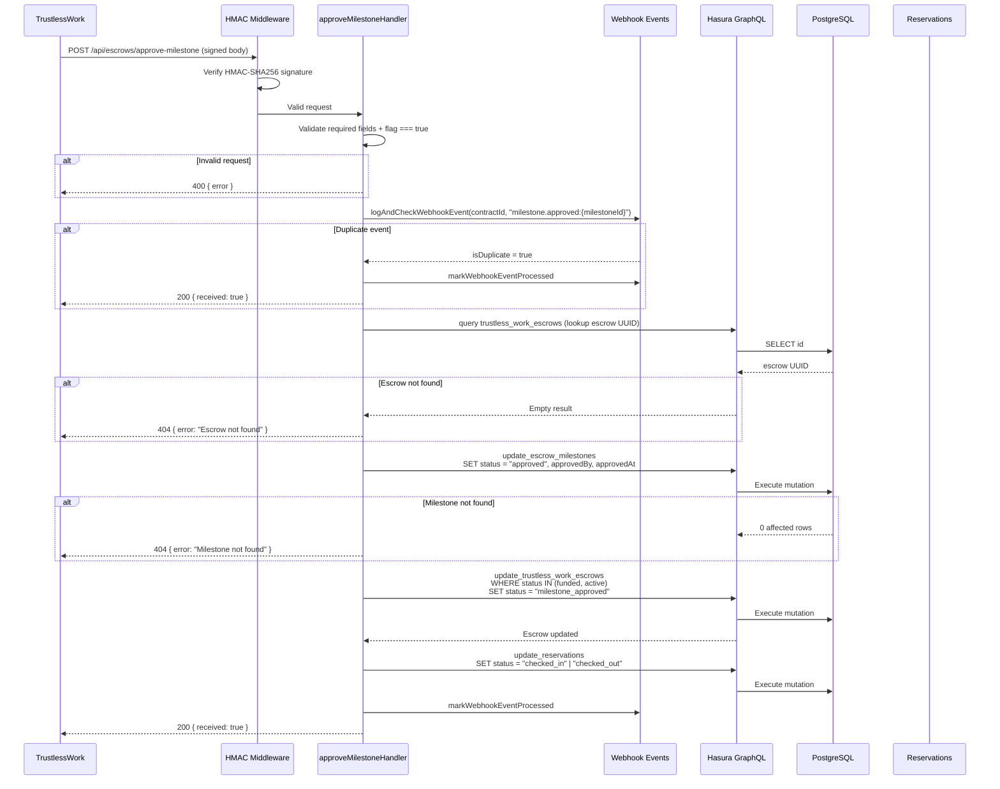

# Approve Milestone

> `POST /api/escrows/approve-milestone` — TrustlessWork callback recording a host-approved milestone.

## Overview

After a guest checks in or checks out of a hotel, the host approves the corresponding
milestone on the Stellar escrow contract. TrustlessWork then sends a signed webhook callback
to this endpoint. The backend verifies the signature, marks the milestone as `approved` in
the database, advances the escrow to `milestone_approved`, and mirrors the status to the
reservation.



## Prerequisites

- The escrow must exist with status `funded` or `active`.
- An `escrow_milestones` record must exist for the given `milestoneId` (seeded during
  escrow creation or by the reconciliation process).

## Request

| Field        | Type      | Description                                      |
|--------------|-----------|--------------------------------------------------|
| `contractId` | `string`  | TrustlessWork smart contract identifier          |
| `milestoneId`| `string`  | Business milestone identifier: `"check_in"` or `"check_out"` |
| `approver`   | `string`  | Host's Stellar public key (`G...` strkey)        |
| `flag`       | `boolean` | Must be `true` to approve                        |

### Example

```json
{
  "contractId": "CAATN5DTEST00001",
  "milestoneId": "check_in",
  "approver": "GDQERENWDDSQZS7R7WQZKGESDRXL525W65XHIVZO4QPQCHRILIUQ2J7Z",
  "flag": true
}
```

### Required Headers

| Header                        | Description                              |
|-------------------------------|------------------------------------------|
| `Content-Type`                | `application/json`                       |
| `x-trustlesswork-signature`   | HMAC-SHA256 signature of the request body |
| `x-trustlesswork-timestamp`   | Unix epoch millisecond timestamp         |

## Milestone Identifiers

The `milestoneId` is a **string business identifier** used in the API. The escrow
contract maps these to numeric indices for on-chain tracking.

| milestoneId  | Contract Index | Meaning              | Reservation Status |
|--------------|----------------|----------------------|--------------------|
| `"check_in"` | `0`            | Guest check-in       | `"checked_in"`     |
| `"check_out"`| `1`            | Guest check-out      | `"checked_out"`    |

The handler uses string comparison (`milestoneId === 'check_in'`) to determine the
reservation status to mirror. Any value other than `"check_in"` results in
`"checked_out"` being set.

## State Transition

```
funded ──────────┐
                 ├── milestone.approved ──► milestone_approved
active ──────────┘
```

The Rust state machine enforces that only `funded` and `active` are valid prior states for
the `milestone_approved` target via the `milestone.approved` event.

## Response

### Success — `200`

```json
{ "received": true }
```

The milestone is now `approved` and the escrow status is `milestone_approved`.

### Success — Idempotent duplicate

If the same milestone approval is retried (same `contractId` + `event_type` including
milestone ID), the handler short-circuits:

```json
{ "received": true }
```

### Error Responses

| Status | Error                                              | When                                          |
|--------|----------------------------------------------------|-----------------------------------------------|
| `400`  | `Missing required fields: contractId, milestoneId, approver, flag` | Any required field is missing |
| `400`  | `flag must be true to approve a milestone`         | `flag` is `false` or not a boolean            |
| `401`  | `Missing x-trustlesswork-signature header`         | HMAC header absent                            |
| `401`  | `Invalid webhook signature`                        | HMAC verification failed                      |
| `404`  | `Escrow not found`                                 | No escrow with the given `contractId`         |
| `404`  | `Milestone not found`                              | No `escrow_milestones` row for the `milestoneId` + escrow |
| `500`  | `Failed to update milestone approval`              | Hasura GraphQL error                          |

## Side Effects

1. **Milestone record updated** — `escrow_milestones` row is set to `status = "approved"`
   with `approvedBy` (wallet address) and `approvedAt` (timestamp).

2. **Escrow status advanced** — `trustless_work_escrows.status` is set to
   `"milestone_approved"` (only if prior state is `funded` or `active`).

3. **Reservation mirror** — The `reservations` table is updated:
   - `check_in` → `status = "checked_in"`
   - `check_out` → `status = "checked_out"`

## Idempotency

The idempotency key is milestone-specific: `milestone.approved:{milestoneId}`. This means
`check_in` and `check_out` approvals are deduplicated independently — approving `check_in`
twice is caught, but approving `check_in` then `check_out` proceeds normally.

## Milestone Lifecycle

In a typical hotel booking:

1. Guest checks in → host approves `check_in` milestone → escrow becomes `milestone_approved`
2. Guest checks out → host approves `check_out` milestone → escrow stays `milestone_approved`
3. After all milestones approved → host (or platform) triggers `release-funds`

Both milestones must be approved before funds can be released. The TrustlessWork contract
enforces this on-chain.

## Wallet Roles

| Role        | Description                                                                                          |
|-------------|------------------------------------------------------------------------------------------------------|
| `approver`  | The host's Stellar wallet that approved the milestone (sent in the callback by TrustlessWork)        |
| `marker`    | The host (hotel) wallet — stored in the escrow record and set during initialization                  |
| `releaser`  | The SafeTrust platform wallet — releases funds after all milestones                                  |

> **Note on naming:** The `approver` field in the `trustless_work_escrows` table stores
> the *guest* wallet address (set during initialization). The `approver` parameter in
> *this* callback is the *host* wallet that approved the milestone — these are
> semantically different despite sharing the name. The handler stores the callback's
> `approver` value in the `escrow_milestones.approved_by` column.

## Error Handling

- **Escrow not found (404):** If no escrow exists for the `contractId`, the lookup query
  returns empty and the handler returns 404.

- **Milestone not found (404):** If the escrow exists but no `escrow_milestones` row matches
  the `milestoneId`, the milestone update returns 0 affected rows.

- **Status guard failure:** If the escrow is not in `funded` or `active`, the Hasura
  mutation returns 0 affected rows, which is treated as "Escrow not found" (404).

## Test Coverage

- **Unit tests (TypeScript):** `webhook/src/routes/escrows/__tests__/approve-milestone.handler.test.ts`
- **Unit tests (JavaScript):** `webhook/src/routes/escrows/__tests__/approve-milestone.handler.test.js`
- **Integration tests (Karate):** `tests/karate/features/escrows/approve-milestone.feature`
  - Valid approval updates milestone and escrow
  - Milestone-specific idempotency keys
  - Missing fields return 400
  - `flag: false` returns 400
  - Escrow not found returns 404
  - Hasura errors return 500
  - Missing/invalid signature returns 401
