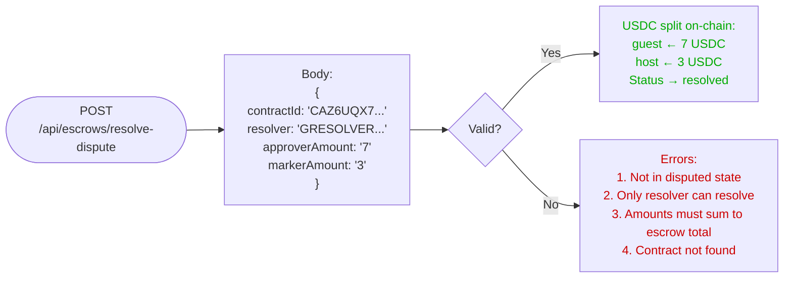

# Dispute Resolution

SafeTrust supports a formal dispute flow for escrow contracts. Either party can raise a dispute, and a designated resolver splits the locked USDC between the guest and host.

## Open a Dispute

### Who is the Resolver

The resolver is a SafeTrust platform wallet (`GRESOLVER...`). It is not one of the transacting parties. When a dispute is raised, the resolver is notified and is the only identity authorized to call the resolve endpoint.

### Why Funds Remain Locked

Once a contract enters the `disputed` state, the Soroban smart contract keeps the USDC locked. No party can withdraw funds until the resolver submits a split decision. This prevents either side from taking unilateral action while the dispute is being adjudicated.

## Resolve a Dispute

### Amount Sum Constraint

`approverAmount + markerAmount` must equal the total escrow amount in USDC. The resolver cannot keep or add funds; the split is a zero-sum redistribution of the locked balance.

### Phase 3 Plan: Human-in-the-Loop AI Approval

Future iterations will introduce an AI-assisted review step that proposes a split recommendation to a human resolver before the on-chain settlement is executed. The human retains final sign-off authority.
