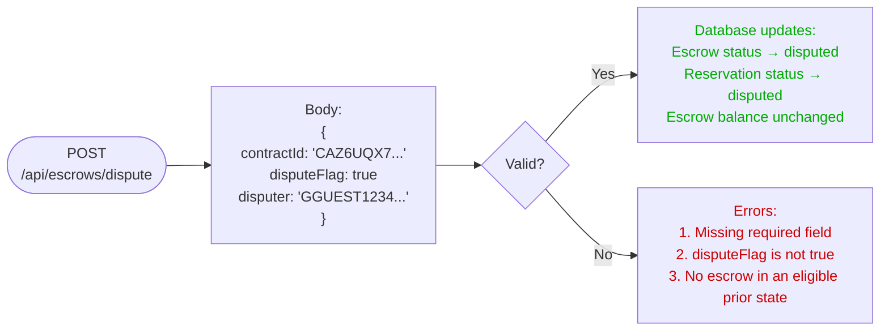
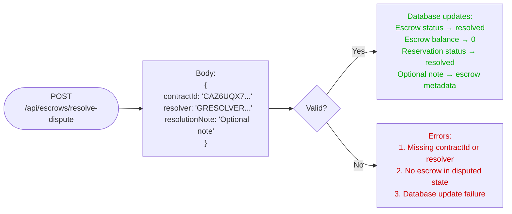
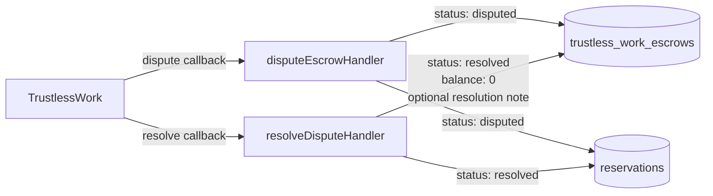
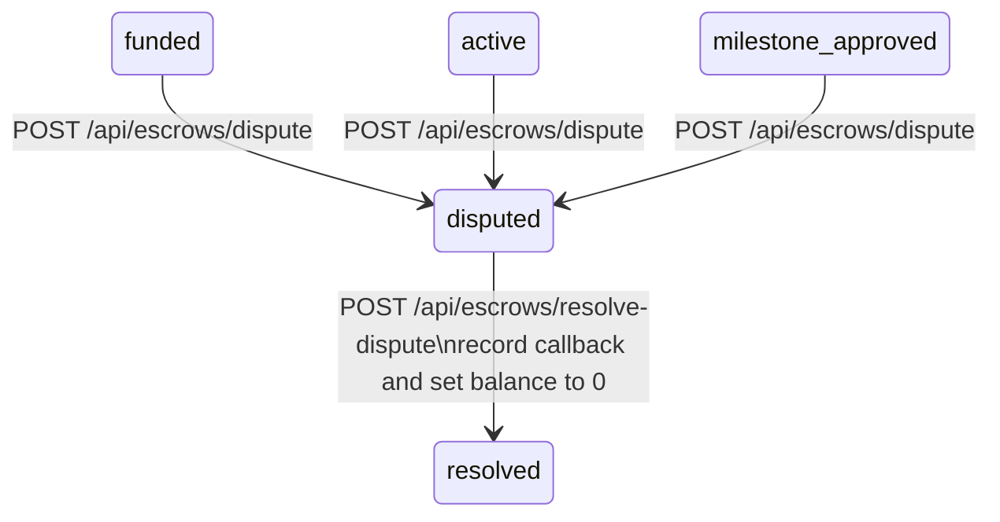

# Dispute and Resolve Dispute

TrustlessWork reports dispute lifecycle changes to SafeTrust through
callbacks. These handlers mirror the resulting state in the
database; they do not submit Soroban transactions or decide how funds
are distributed.

## Open dispute flow

## Resolve dispute flow

## Callback responsibilities

## Settlement boundary

`POST /api/escrows/resolve-dispute` is a callback that records an
already-reported resolution. It does not accept `approverAmount` or
`markerAmount`, split USDC, or invoke TrustlessWork. No separate
disputed-escrow settlement operation is implemented in this repository.
The existing `POST /api/escrows/release-funds` callback belongs to the
normal `milestone_approved` to `completed` flow and is not a dispute
settlement endpoint.

## State machine context

## Phase 3 — Human-in-loop AI approval

In Phase 3, SafeTrust will introduce human-in-loop approval
workflows for high-value disputes. An AI agent will analyze
the dispute context (booking metadata, milestone history,
conversation logs) and propose a resolution. A human reviewer
will approve or adjust that proposal before any upstream
resolution action. The callback payload and database behavior
described above remain unchanged.
