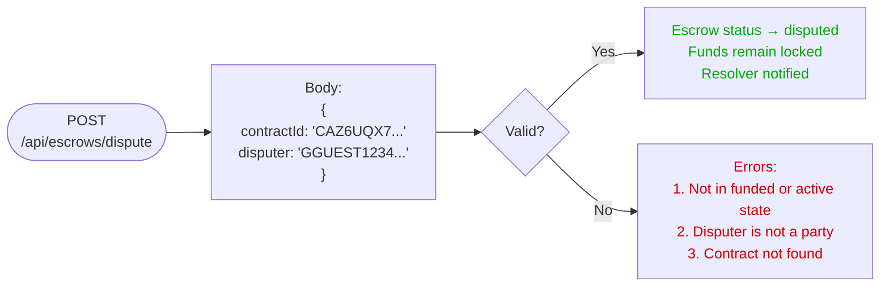
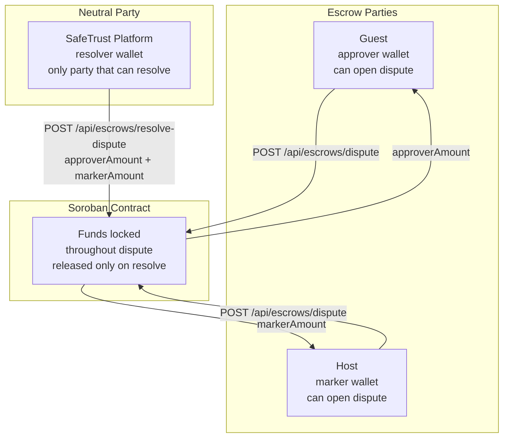
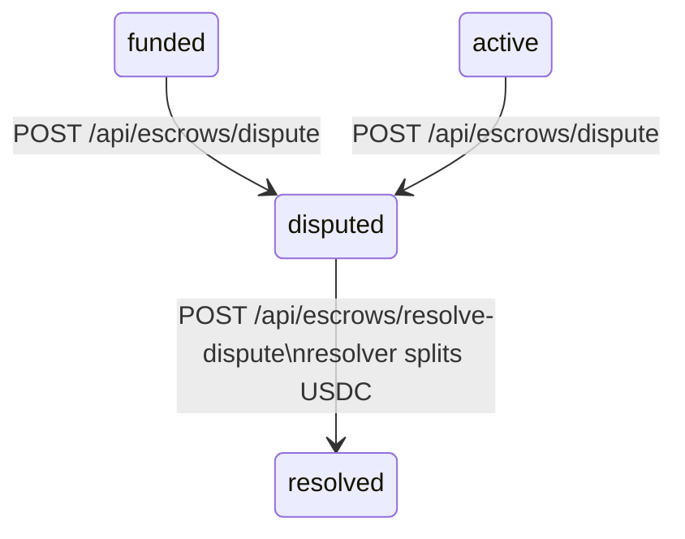

# Dispute and Resolve Dispute

Dispute resolution is a two-step process. Any party to the
escrow can open a dispute — only the designated resolver
(SafeTrust platform wallet) can resolve it.

## Open dispute flow



## Resolve dispute flow


## Role responsibilities



## Amount constraint

`approverAmount + markerAmount` must equal the original
escrow deposit exactly. The Soroban contract enforces this
on-chain — if amounts do not sum to the escrow total the
transaction is rejected before any USDC moves.

```
Example escrow: 10 USDC total

Valid:
  approverAmount: "7"  → guest receives 7 USDC
  markerAmount:   "3"  → host receives 3 USDC
  7 + 3 = 10 ✅

Invalid:
  approverAmount: "7"
  markerAmount:   "2"
  7 + 2 = 9 ≠ 10 ❌ → transaction rejected
```

## Why funds remain locked during dispute

Funds are held inside the Soroban smart contract — not
in SafeTrust's database or any centralized wallet. Once
a dispute is opened the contract prevents any release or
cancellation path from executing. Only the `resolve-dispute`
operation signed by the resolver wallet can move USDC out
of the contract. SafeTrust has no ability to unlock funds
unilaterally — this is by design.

## State machine context



## Phase 3 — Human-in-loop AI approval

In Phase 3, SafeTrust will introduce human-in-loop approval
workflows for high-value disputes. An AI agent will analyze
the dispute context (booking metadata, milestone history,
conversation logs) and propose a split. A human reviewer
approves or adjusts before the resolver wallet signs.
The Soroban contract interface is unchanged — only the
decision process before signing.