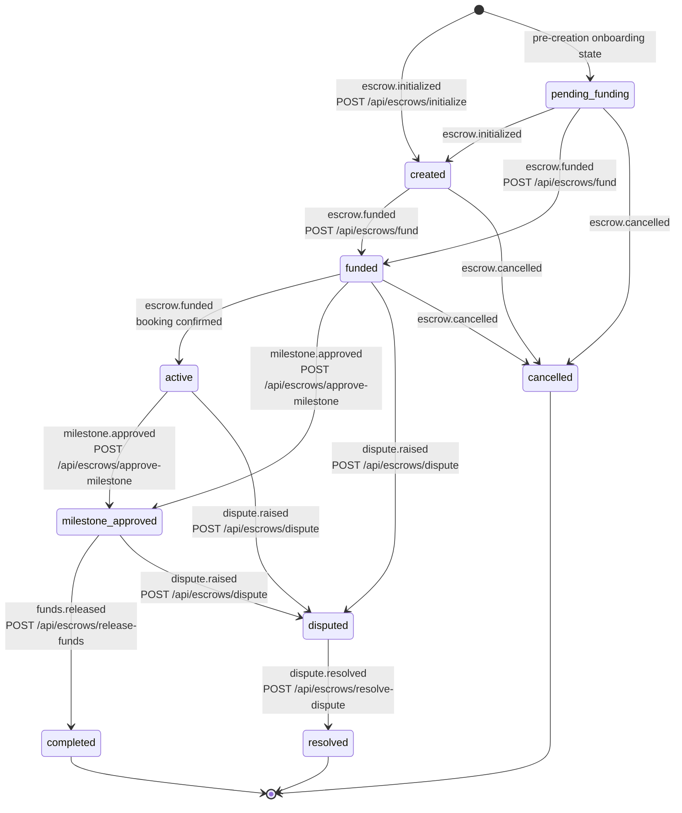
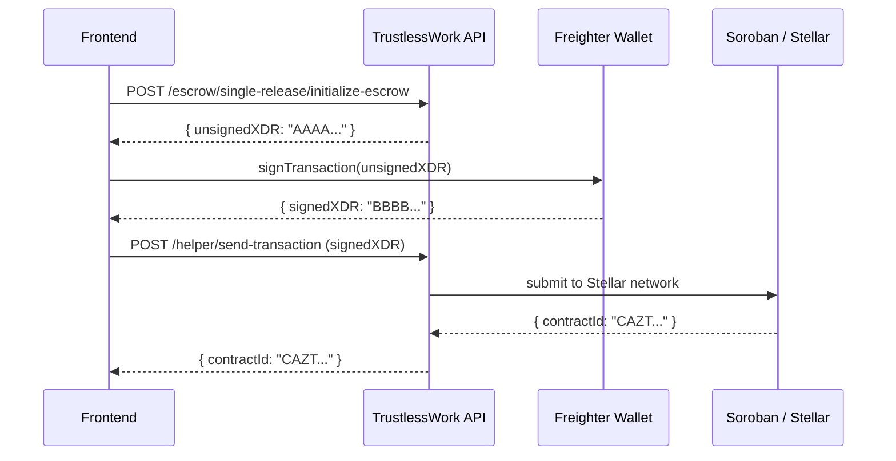
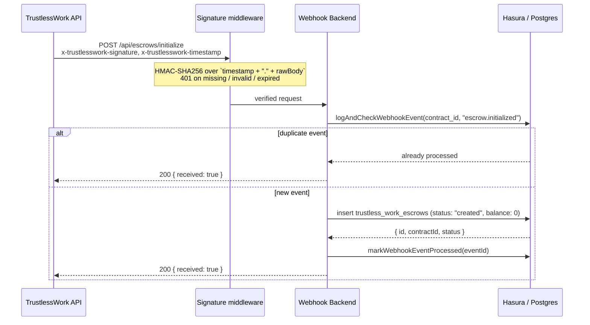

# Escrow Lifecycle Documentation

This document describes the full escrow lifecycle: the canonical state machine, the XDR
signing flow, and the mapping between webhook handlers and state transitions.

**Sources of truth referenced by this document**

| Concern | Source of truth |
|---|---|
| Valid states | [`crates/escrow-state-machine/src/states.rs`](../../crates/escrow-state-machine/src/states.rs) (`EscrowStatus`) |
| Valid transitions | [`crates/escrow-state-machine/src/transitions.rs`](../../crates/escrow-state-machine/src/transitions.rs) (`transition_table()`) |
| Persisted values | [`migrations/safetrust/1731909059420_create_trustless_work_escrows/up.sql`](../../migrations/safetrust/1731909059420_create_trustless_work_escrows/up.sql) (`status` CHECK constraint) |
| End-to-end behaviour | [`tests/karate/features/escrows/escrow-lifecycle.feature`](../../tests/karate/features/escrows/escrow-lifecycle.feature) |

---

## State Machine Diagram

All transitions below are driven by **TrustlessWork webhook callbacks** into this backend.
Handlers derive their allowed prior states from the Rust state machine via
`getValidPriorStates(...)`, so this diagram mirrors `transition_table()`.

The state machine covers all **nine** states defined by the `EscrowStatus` enum and the
database CHECK constraint — `created`, `pending_funding`, `funded`, `active`,
`milestone_approved`, `completed`, `disputed`, `resolved`, `cancelled` — and the six
webhook handlers under `webhook/src/routes/escrows/`.

### Notes on `pending_funding` and `active`

- **`pending_funding`** is the *pre-creation onboarding* state: it has no inbound
  transition in `transition_table()` (a row may be seeded in it before the escrow is
  deployed on Stellar). Because of that, funding is legal from **either `created` or
  `pending_funding`** — `fund.handler.ts` filters on
  `status: { _in: ["created", "pending_funding"] }`, and
  `escrow-lifecycle.feature` asserts a 404 status-guard once the escrow is already `funded`.
- **`active`** is reached implicitly when an escrow is fully funded; no handler writes it
  directly. Milestone approval is therefore legal from **`funded` or `active`**.

---

## XDR Signing Sequence Diagram

> **Scope:** this backend does **not** create, sign, or submit XDR. There is no
> `/api/escrows/send-transaction` route. XDR creation happens in the frontend against the
> TrustlessWork API, signing happens in the user's wallet, and this backend only learns
> about the result through **HMAC-signed webhook callbacks**. The two flows are shown
> separately below so they are not conflated.

### Phase A — Frontend XDR flow (outside this backend)

### Phase B — Webhook callback into this backend

Every escrow endpoint follows this same contract:

1. **Authentication** — `x-trustlesswork-signature` (HMAC-SHA256 over
   `timestamp + "." + rawBody`) plus a fresh `x-trustlesswork-timestamp`; failures return `401`.
   These routes deliberately do **not** use `authMiddleware` — they are TrustlessWork
   callbacks, not user requests.
2. **Idempotency** — `logAndCheckWebhookEvent(contract_id, event_type)` short-circuits
   duplicates with `200 { received: true }`.
3. **Status guard** — the Hasura mutation filters on the valid prior states from the Rust
   state machine; zero affected rows returns `404 { error: "Escrow not found..." }`.
4. **Success** — `200 { received: true }`. No XDR is ever returned to the caller.

---

## Handler-to-State Mapping Table

All handlers live in `webhook/src/routes/escrows/` and respond `200 { received: true }`.

| Handler | Endpoint | Idempotency event type | Valid prior states | Resulting state |
|---|---|---|---|---|
| `initialize.handler.ts` | `POST /api/escrows/initialize` | `escrow.initialized` | — (insert) | `created` |
| `fund.handler.ts` | `POST /api/escrows/fund` | `escrow.funded` | `created`, `pending_funding` | `funded` |
| `approve-milestone.handler.ts` | `POST /api/escrows/approve-milestone` | `milestone.approved` | `funded`, `active` | `milestone_approved` |
| `release-funds.handler.ts` | `POST /api/escrows/release-funds` | `escrow.completed` | `milestone_approved` | `completed` (balance → 0) |
| `dispute.handler.ts` | `POST /api/escrows/dispute` | `escrow.disputed` | `funded`, `active`, `milestone_approved` | `disputed` |
| `resolve-dispute.handler.ts` | `POST /api/escrows/resolve-dispute` | `escrow.resolved` | `disputed` | `resolved` |

Each handler also mirrors the escrow status onto `public.reservations`. Milestone approval
mirrors `check_in → checked_in` and `check_out → checked_out`, while the escrow itself moves
to `milestone_approved` in both cases.

---

## State Name Reference

All state names used above match the `EscrowStatus` enum and the database CHECK constraint:

- `created` – Escrow deployed on Stellar and persisted; awaiting guest funding
- `pending_funding` – Pre-creation onboarding state; no inbound lifecycle transition
- `funded` – Guest deposited USDC; funds locked in the escrow contract
- `active` – Escrow fully funded and booking confirmed (implicit; not written by a handler)
- `milestone_approved` – Host approved a milestone (check-in or check-out)
- `completed` – All milestones approved; funds released to host, balance set to 0
- `disputed` – Guest or host raised a dispute
- `resolved` – Dispute resolved by the arbitrator/resolver
- `cancelled` – Booking cancelled before check-in

`[*]` in the diagram is Mermaid's start/end marker, not a database value.

---

## Dependencies

- Depends on: Issue #599
- Related to: escrow handler implementations in `webhook/src/routes/escrows/*.handler.ts`
- Canonical rules: `crates/escrow-state-machine/`
- Target audience: contributors working on escrow handlers

---

## Git Guidelines

- Follow the [Contributing Guide](../../CONTRIBUTORS_GUIDELINE.md) and the
  [Git Guideline](../../GIT_GUIDELINE.md)
- This document renders on GitHub using Markdown with Mermaid diagrams
- Ensure all state names match `EscrowStatus` and the migration CHECK constraint
- When `transition_table()` changes, update the diagram and the mapping table in the same PR
