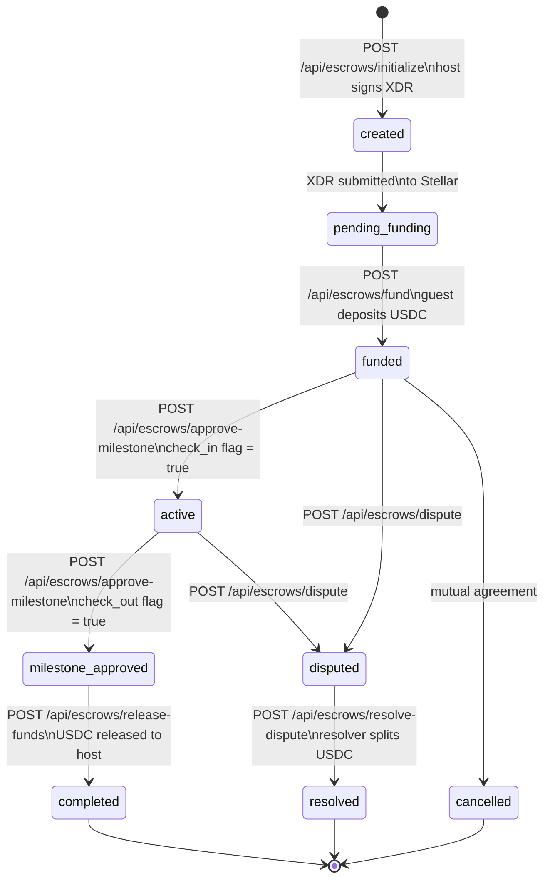
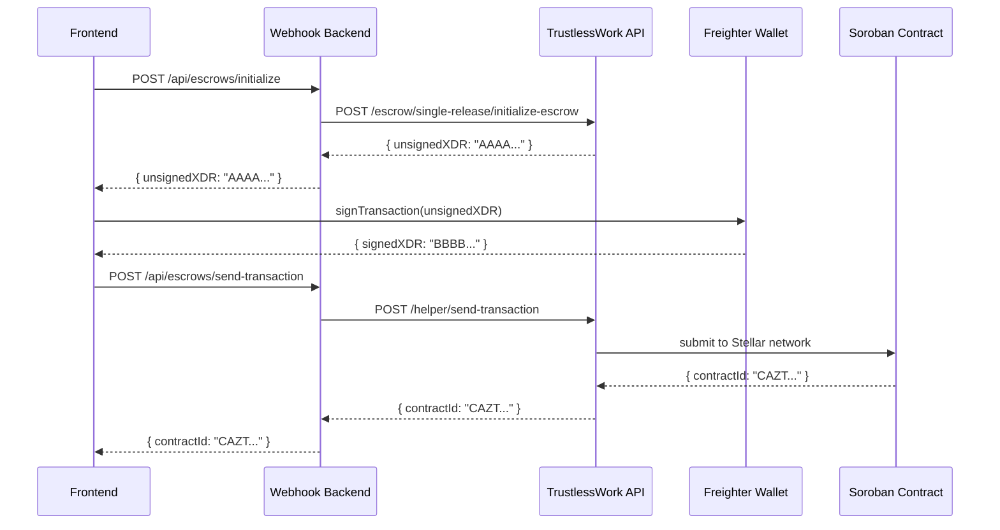

# Escrow Lifecycle Documentation

This document describes the full escrow lifecycle, including state transitions, XDR signing flows, and handler mappings.

---

## State Machine Diagram

The state machine above covers all eight states (`created`, `pending_funding`, `funded`, `active`, `milestone_approved`, `completed`, `disputed`, `cancelled`) and six primary webhook handlers. Transitions are triggered by API calls and business logic conditions (check_in/check_out flags).

---

## XDR Signing Sequence Diagram

This two-phase XDR signing flow involves:
1. **Initialization**: Backend generates an unsigned XDR via the TrustlessWork API.
2. **Frontend signing**: Frontend prompts the user's wallet (Freighter) to sign the XDR.
3. **Submission**: Signed transaction is sent to the Soroban contract on the Stellar network, which returns a contract ID.

---

## Handler-to-State Mapping Table

| Handler | Endpoint | State Transition |
|---|---|---|
| `initialize.handler.ts` | `POST /api/escrows/initialize` | `→ created` |
| `fund.handler.ts` | `POST /api/escrows/fund` | `created → funded` |
| `approve-milestone.handler.ts` | `POST /api/escrows/approve-milestone` | `funded → active → milestone_approved` |
| `release-funds.handler.ts` | `POST /api/escrows/release-funds` | `milestone_approved → completed` |
| `dispute.handler.ts` | `POST /api/escrows/dispute` | `funded/active → disputed` |
| `resolve-dispute.handler.ts` | `POST /api/escrows/resolve-dispute` | `disputed → resolved` |

---

## State Name Reference

All state names used in the diagrams and table match the actual database values:

- `created` – Escrow initialized, XDR pending host signature
- `pending_funding` – XDR submitted to Stellar, awaiting guest deposit
- `funded` – USDC deposited by guest
- `active` – Milestone approved (check_in = true)
- `milestone_approved` – Check-out confirmed (check_out = true)
- `completed` – USDC released to host
- `disputed` – Dispute opened (from `funded` or `active`)
- `resolved` – Dispute resolved, USDC split by resolver
- `cancelled` – Mutual agreement to cancel
- `[*]` – Terminal state (exit point)

---

## Dependencies

- Depends on: Issue #599
- Related to: Escrow handler implementations (`*.handler.ts` files)
- Target audience: Contributors working on escrow handlers

---

## Git Guidelines

- Follow the [Contributing Guide](https://github.com/Priest-Codes/backend-SafeTrust.git)
- This document should be rendered on GitHub using Markdown with Mermaid diagrams
- Ensure all state names match database schema values
- Keep handler mappings in sync with actual handler file implementations