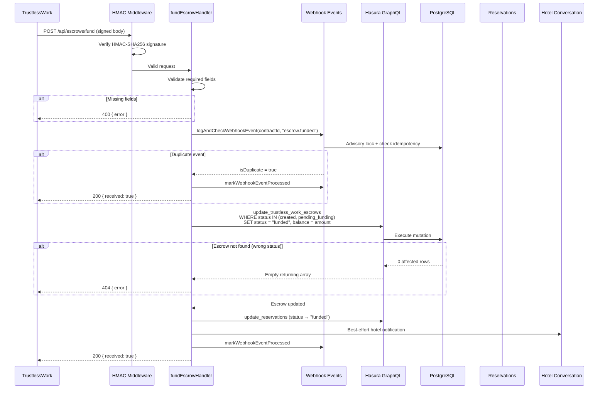

# Fund Escrow

> `POST /api/escrows/fund` — TrustlessWork callback confirming a guest's USDC deposit on Stellar.

## Overview

When a guest funds an escrow contract on the Stellar network, TrustlessWork sends a signed
webhook callback to this endpoint. The backend verifies the HMAC signature, updates the escrow
status from `created` / `pending_funding` to `funded`, records the deposited balance, and
notifies the hotel conversation channel.



## Prerequisites

- The escrow must exist with status `created` or `pending_funding` (set by the
  [initialize](./initialize-escrow.md) operation).
- TrustlessWork must have completed the on-chain deposit and sent the signed callback.

## Request

| Field       | Type     | Description                                    |
|-------------|----------|------------------------------------------------|
| `contractId`| `string` | TrustlessWork smart contract identifier        |
| `signer`    | `string` | Guest's Stellar public key (`G...` strkey)     |
| `amount`    | `number` | Deposited amount in USDC stroops (7 decimals)  |

### Example

```json
{
  "contractId": "CAATN5DTEST00001",
  "signer": "GDQERENWDDSQZS7R7WQZKGESDRXL525W65XHIVZO4QPQCHRILIUQ2J7Z",
  "amount": 2500.00
}
```

### Required Headers

| Header                        | Description                              |
|-------------------------------|------------------------------------------|
| `Content-Type`                | `application/json`                       |
| `x-trustlesswork-signature`   | HMAC-SHA256 signature of the request body |
| `x-trustlesswork-timestamp`   | Unix epoch millisecond timestamp         |

## State Transition

```
created ──────────┐
                  ├── escrow.funded ──► funded
pending_funding ──┘
```

The Rust state machine (`crates/escrow-state-machine/src/transitions.rs`) enforces that
only `created` and `pending_funding` are valid prior states for the `funded` target via
the `escrow.funded` event.

## Response

### Success — `200`

```json
{ "received": true }
```

The escrow status is now `funded` and `balance` equals the deposited `amount`.

### Success — Idempotent duplicate

If TrustlessWork retries the same callback (same `contractId` + `event_type`), the handler
short-circuits immediately:

```json
{ "received": true }
```

No database mutations occur; the webhook event is marked processed.

### Error Responses

| Status | Error                                              | When                                    |
|--------|----------------------------------------------------|-----------------------------------------|
| `400`  | `Missing required fields: contractId, signer, amount` | Any required field is missing or empty |
| `400`  | `Amount cannot be zero or negative`                | `amount <= 0`                          |
| `401`  | `Missing x-trustlesswork-signature header`         | HMAC header absent                     |
| `401`  | `Invalid webhook signature`                        | HMAC verification failed               |
| `401`  | `Webhook timestamp expired or invalid`             | Timestamp outside ±5 minute window     |
| `404`  | `Escrow not found for contractId: {contractId}`    | No escrow in `created`/`pending_funding` state |
| `500`  | `Failed to update escrow status`                   | Hasura GraphQL error with details      |
| `500`  | `Internal server error`                            | Unexpected backend failure             |

## Side Effects

1. **Reservation mirror** — The `reservations` table is updated with `status = "funded"` to
   keep the booking view in sync with the escrow state.

2. **Hotel conversation notification** — A best-effort automated message is sent to the
   hotel conversation channel: *"SafeTrust: Your deposit has been confirmed on the Stellar
   network. Your booking is secured."* This never blocks the response.

3. **Webhook event logging** — The event is recorded in `trustless_work_webhook_events` with
   `processed = true` for idempotency on retries.

## Idempotency

Duplicate detection uses `(contract_id, event_type)` as the idempotency key. An advisory
lock (`pg_advisory_xact_lock`) prevents concurrent duplicate processing. Two concurrent
deliveries of the same event will serialize — the first processes normally, the second
returns `200` without re-running mutations.

## Amount Format

The `amount` field is stored directly as the `balance` column (type `DECIMAL(20, 7)`).
Values are in USDC stroops — the smallest unit with 7 decimal places. For example:

| USDC   | Stroops (amount value) |
|--------|------------------------|
| 100.00 | 100.0000000            |
| 0.50   | 0.5000000              |
| 2500.00| 2500.0000000           |

## Wallet Roles

| Role       | Description                                                  |
|------------|--------------------------------------------------------------|
| `signer`   | The guest's Stellar wallet that deposited funds on-chain     |
| `marker`   | The host (hotel) wallet — set during escrow initialization   |
| `releaser` | The SafeTrust platform wallet — releases funds after stay    |

## Error Handling

- **404 on status guard failure:** If the escrow is already `funded` (or in any other state
  not in `[created, pending_funding]`), the Hasura mutation returns 0 affected rows. The
  handler interprets this as "not found" and returns 404. This prevents double-funding.

- **Hotel notification failure:** If the hotel conversation notification fails, the error
  is logged but does not affect the response. The escrow state update is committed
  regardless.

## Test Coverage

- **Unit tests:** `webhook/src/routes/escrows/__tests__/fund.handler.test.ts`
- **Integration tests (Karate):** `tests/karate/features/escrows/fund.feature`
  - Valid fund callback updates status and balance
  - Duplicate callback is idempotent
  - Missing fields return 400
  - Amount zero returns 400
  - Unknown contractId returns 404
  - Missing/invalid signature returns 401
