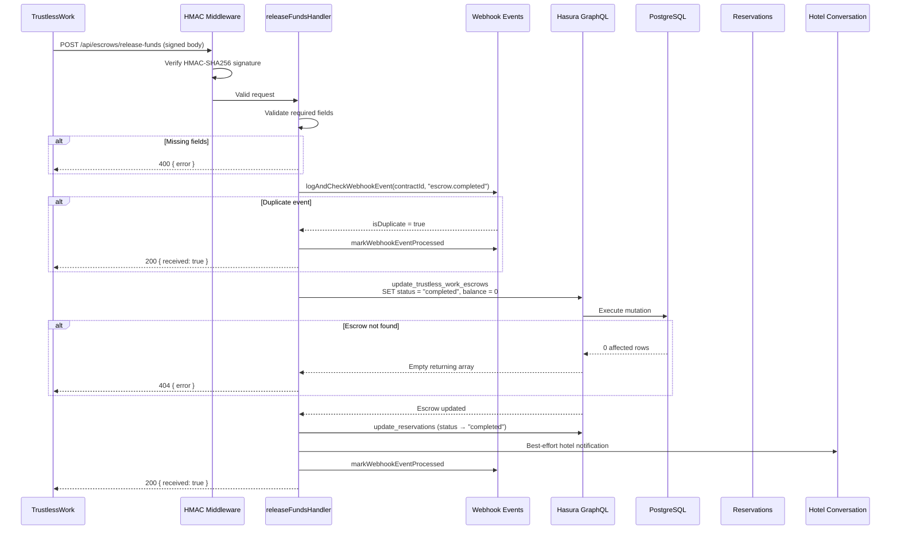
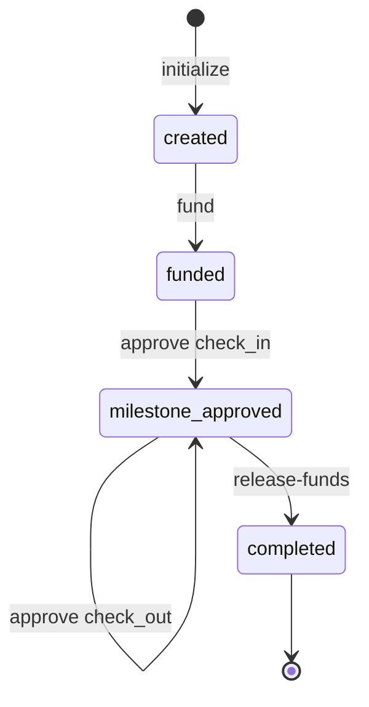
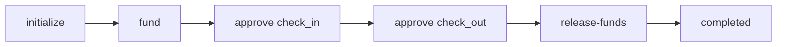

# Release Funds

> `POST /api/escrows/release-funds` — TrustlessWork callback confirming funds have been released to the host.

## Overview

After all milestones are approved, the SafeTrust platform triggers fund release on the
Stellar escrow contract. TrustlessWork executes the on-chain transfer and sends a signed
webhook callback to this endpoint. The backend verifies the signature, marks the escrow as
`completed`, zeroes the balance, and notifies the hotel conversation channel.



## Prerequisites

- The escrow must exist with status `milestone_approved`.
- All milestones must have been approved (the TrustlessWork contract enforces this
  on-chain before allowing the release transaction).
- The `releaseSigner` must be the SafeTrust platform wallet. The on-chain contract
  (or TrustlessWork) verifies this matches the escrow's stored `releaser` before
  executing the release. The backend handler itself does not validate the wallet
  address against the stored escrow — it relies on TrustlessWork's HMAC signature
  as proof of authenticity.

## Request

| Field           | Type     | Description                                         |
|-----------------|----------|-----------------------------------------------------|
| `contractId`    | `string` | TrustlessWork smart contract identifier             |
| `releaseSigner` | `string` | Platform wallet Stellar public key (`G...` strkey)  |

### Example

```json
{
  "contractId": "CAATN5DTEST00001",
  "releaseSigner": "GRELEASER111WALLETADDRESS11111111111111111111111111111"
}
```

### Required Headers

| Header                        | Description                              |
|-------------------------------|------------------------------------------|
| `Content-Type`                | `application/json`                       |
| `x-trustlesswork-signature`   | HMAC-SHA256 signature of the request body |
| `x-trustlesswork-timestamp`   | Unix epoch millisecond timestamp         |

## State Transition

```
milestone_approved ── funds.released ──► completed
```

The Rust state machine defines `milestone_approved` as the only valid prior state for
`completed` via the `funds.released` event.

> **Note:** The handler itself does **not** call `getValidPriorStates()` to enforce this
> transition at the database level. State enforcement relies on TrustlessWork verifying the
> on-chain transaction before sending this callback. The handler directly sets
> `status = "completed"` without a status guard in the Hasura mutation.

## Response

### Success — `200`

```json
{ "received": true }
```

The escrow is now `completed` and `balance` is `0`.

### Success — Idempotent duplicate

If TrustlessWork retries the same callback (same `contractId` + `event_type`), the handler
short-circuits immediately:

```json
{ "received": true }
```

The escrow, balance, and reservation rows remain unchanged. The webhook event is
marked as processed in `trustless_work_webhook_events` to prevent re-processing.

### Error Responses

| Status | Error                                              | When                                    |
|--------|----------------------------------------------------|-----------------------------------------|
| `400`  | `Missing required fields: contractId, releaseSigner` | Either field is missing               |
| `401`  | `Missing x-trustlesswork-signature header`         | HMAC header absent                     |
| `401`  | `Invalid webhook signature`                        | HMAC verification failed               |
| `404`  | `Escrow not found for contractId: {contractId}`    | No escrow with the given `contractId`  |
| `500`  | `Failed to update escrow status`                   | Hasura GraphQL error with details      |
| `500`  | `Internal server error`                            | Unexpected backend failure             |

## Side Effects

1. **Balance zeroed** — `balance` is set to `0` to reflect that funds have been
   transferred on-chain.

2. **Reservation mirror** — The `reservations` table is updated with
   `status = "completed"`.

3. **Hotel conversation notification** — A best-effort automated message is sent:
   *"SafeTrust: Funds have been released. Thank you for booking with us."*
   This never blocks the response.

4. **Webhook event logging** — The event is recorded in `trustless_work_webhook_events`
   with `processed = true`.

## Idempotency

Duplicate detection uses `(contract_id, event_type)` where `event_type = "escrow.completed"`.
An advisory lock prevents concurrent duplicate processing.

## Wallet Roles

| Role        | Description                                                              |
|-------------|--------------------------------------------------------------------------|
| `releaser`  | The SafeTrust platform wallet — the only party authorized to release     |
| `marker`    | The host (hotel) wallet — receives the released funds on-chain           |
| `approver`  | The guest wallet — approved milestones before release was triggered      |

The flow of funds on-chain:
```
Escrow Contract → marker (host wallet)
```

The `releaser` (platform) authorizes the transfer. The `marker` (host) receives the USDC.

## Complete Lifecycle

The full escrow lifecycle with all three documented operations:



Simplified linear flow:



| Step | Endpoint                        | State After       |
|------|---------------------------------|--------------------|
| 1    | `POST /api/escrows/initialize`  | `created`          |
| 2    | `POST /api/escrows/fund`        | `funded`           |
| 3    | `POST /api/escrows/approve-milestone` (check_in) | `milestone_approved` |
| 4    | `POST /api/escrows/approve-milestone` (check_out) | `milestone_approved` |
| 5    | `POST /api/escrows/release-funds` | `completed`      |

## Error Handling

- **No status guard:** Unlike `fund` and `approve-milestone`, this handler does not filter
  by prior status in the Hasura mutation. If called on an escrow in any state (even
  `created`), it would succeed at the database level. TrustlessWork's on-chain verification
  is the primary guard preventing premature release.

- **Hotel notification failure:** Logged but does not affect the response. The escrow
  state update is committed regardless.

## Test Coverage

- **Integration tests (Karate):** `tests/karate/features/escrows/release-funds.feature`
  - Successful release updates status and zeroes balance
  - Missing contractId returns 400
  - Missing releaseSigner returns 400
  - Escrow not found returns 404
  - Missing/invalid signature returns 401
- **Lifecycle integration test:** `tests/karate/features/escrows/escrow-lifecycle.feature`
  - Full 4-step lifecycle: initialize → fund → approve → release completes within 10s
  - Post-completion re-fund is rejected (status guard in fund handler)
