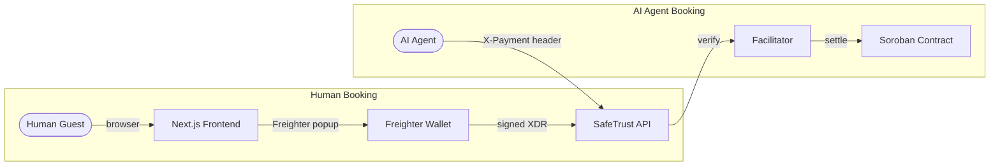
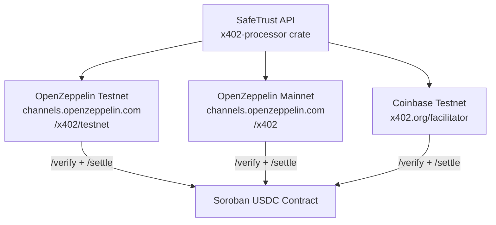
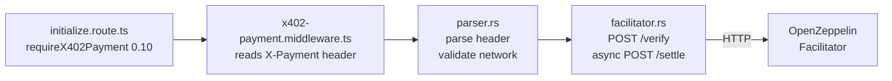

# x402 Protocol — Agentic Payments on Stellar

x402 is an open protocol from Coinbase that enables per-request
HTTP payments designed for AI agents and automated systems that
cannot interact with browser wallets. SafeTrust implements
x402 v2 on Stellar using Soroban authorization entries and
USDC SEP-41.

## Why x402 matters for SafeTrust

Human users book through a browser with Freighter wallet.
AI agents — travel bots, autonomous booking systems,
x402-aware applications — cannot open browser popups.
Without x402, AI agents cannot book on SafeTrust at all.



## End-to-end payment flow

```mermaid
sequenceDiagram
    participant AG as AI Agent
    participant BE as SafeTrust API
    participant FAC as OpenZeppelin Facilitator
    participant SC as Soroban USDC Contract

    AG->>BE: POST /api/escrows/initialize\n(no X-Payment header)
    BE-->>AG: 402 Payment Required\n{ accepts: [{\n  scheme: exact\n  network: stellar:testnet\n  amount: 0.10 USDC\n  asset: USDC SEP-41\n  facilitator_url: ...\n}]}

    AG->>SC: authorize USDC transfer\n(signed Soroban auth entry)

    AG->>BE: POST /api/escrows/initialize\nX-Payment: x402 <base64-auth>

    BE->>BE: validateX402Payment(...)
    BE->>FAC: POST /verify\n{ payload, amount, network }
    FAC-->>BE: { isValid: true, payer: GAGENT... }

    BE->>BE: spawn in-memory settlement task
    BE-->>AG: 200 OK\nrequest accepted; settlement pending

    BE->>FAC: POST /settle (async)
    alt Settlement confirmed
        FAC->>SC: settle USDC on-chain
        FAC-->>BE: success
        Note over BE,AG: Only now may the payment be treated as settled
    else Settlement fails
        FAC-->>BE: error
        BE->>BE: log failure only
        Note over BE,AG: Booking success is not confirmed
    end
```

The current `validateX402Payment` implementation returns after `/verify`
and starts `/settle` in a fire-and-forget task. Consequently, the HTTP 200
response means the request passed verification and was accepted for
processing; it is not proof of settlement and must not be reported as a
confirmed, paid booking.

The background task is in-memory and currently only logs settlement
failures. It has no durable retry queue, idempotency record, or settlement
reconciliation. Before this flow is production-ready, persist a pending
settlement keyed by a stable payment identifier, retry it idempotently after
transient failures, reconcile facilitator or on-chain status, and expose
booking success only after that record becomes settled.

## Stellar vs EVM difference

x402 was designed for EVM chains where a payment is an
on-chain transaction in the `X-Payment` header. On Stellar
the mechanism is different — the client sends a signed
Soroban authorization entry, not a broadcast transaction.

| Aspect | EVM x402 | Stellar x402 |
|---|---|---|
| Payment proof | On-chain transaction hash | Signed Soroban auth entry |
| What moves on-chain | ETH/ERC-20 transfer | USDC SEP-41 authorization |
| Signing | secp256k1 | Ed25519 auth-entry signing |
| Facilitator role | Verify tx included | Verify + settle auth entry |

## USDC SEP-41 contract addresses

| Network | SEP-41 Contract |
|---|---|
| Testnet | `CBIELTK6YBZJU5UP2WWQEUCYKLPU6AUNZ2BQ4WWFEIE3USCIHMXQDAMA` |
| Mainnet | `CCW67TSZV3SSS2HXMBQ5JFGCKJNXKZM7UQUWUZPUTHXSTZLEO7SJMI75` |

## Facilitators



| Facilitator | Endpoint | Networks |
|---|---|---|
| OpenZeppelin | `channels.openzeppelin.com/x402/testnet` | Testnet |
| OpenZeppelin | `channels.openzeppelin.com/x402` | Mainnet |
| Coinbase | `x402.org/facilitator` | Testnet only |

## Human user protection

`X402_ENABLED=false` is the default. On the escrow initialization route:

- A request with any explicit x402 header (`X-Payment`,
  `X-Payment-Protocol`, or `X-Payment-Required`) still enters the x402 flow.
- A request without an explicit x402 header enters the TrustlessWork callback
  flow and must pass its signature check.

When `X402_ENABLED=true`, a request bypasses x402 only when it includes
`X-TrustlessWork-Signature` and no explicit x402 header. Without either, the
route returns `402 Payment Required`; with an explicit x402 header, it validates
that payment even if a TrustlessWork signature is also present. Firebase
authentication does not create an exemption on this route.

## Rust crate wiring



## Environment variables

```bash
# Enable x402 payment requirement on the escrow initialization route
# TrustlessWork callbacks can bypass it with their signature header
X402_ENABLED=false

# x402 facilitator endpoint
X402_FACILITATOR_URL=https://channels.openzeppelin.com/x402/testnet

# SafeTrust platform wallet — receives booking fees
SAFETRUST_PLATFORM_WALLET=

# Stellar network for USDC contract address selection
STELLAR_NETWORK=testnet
```
